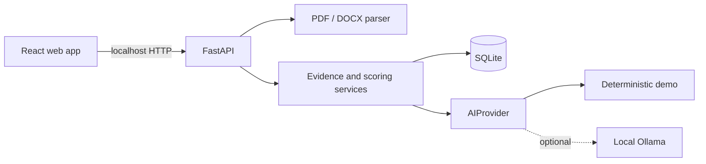

# Architecture

## System boundary

The frontend is a multi-route working prototype. FastAPI owns parsing, analysis, evidence decisions, interview state, and persistence. No resume content is sent to analytics or a hosted AI provider.

## Domain flow

1. Parse PDF/DOCX and measure extraction signals.
2. Extract job requirements or select a seeded role.
3. Link skills to projects, claims, interview evidence, and requirements.
4. Ask resume- and gap-aware interview questions.
5. Evaluate only observable answer content.
6. update demonstrated claim confidence without claiming external truth.
7. apply Evidence Lock before resume rewriting.
8. turn gaps into a time-boxed learning and practice plan.

## Data model

`CandidateProfile`, `ResumeRecord`, `InterviewSession`, and `AppState` are persisted locally. Demo seed content is non-personal and can be reset. Production deployments should add encryption, user authentication, migration management, and retention controls.

## AI provider boundary

`backend/app/providers/base.py` defines `AIProvider`: resume extraction, job analysis, evidence graph, interview question generation, answer evaluation, resume rewriting, learning plan, and transcript analysis. `DemoAIProvider` is deterministic. Ollama configuration is documented but cannot bypass Evidence Lock.

