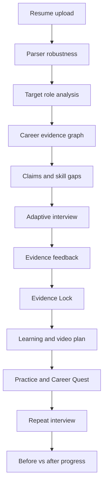
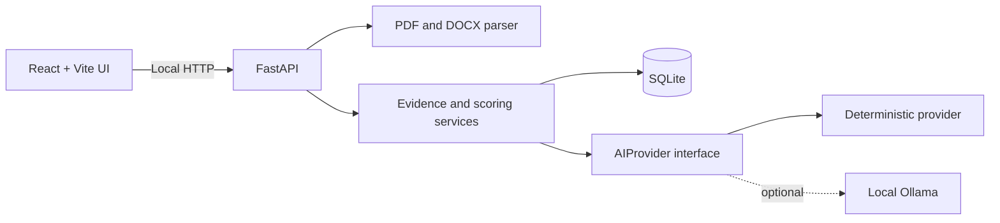

# ProofCoach AI — Complete Project Report

> **Tagline:** Build it. Prove it. Defend it.  
> **Report date:** 27 September 2026  
> **Project status:** Complete hackathon prototype; deterministic demo deployed  
> **Public demo:** https://proofcoach-ai.vercel.app  
> **Source repository:** `sinanoffic/proofcoach-ai` (private)  
> **Stable branch:** `main`  
> **Verified deployment commit:** `a5b1078b5c1c7e3b457252c4a6998140ec62bedd`

## Table of contents

1. [Executive summary](#1-executive-summary)
2. [Problem and product thesis](#2-problem-and-product-thesis)
3. [Target users](#3-target-users)
4. [Complete product workflow](#4-complete-product-workflow)
5. [Implemented application pages](#5-implemented-application-pages)
6. [Feature report](#6-feature-report)
7. [Core innovations](#7-core-innovations)
8. [Scoring and transparency model](#8-scoring-and-transparency-model)
9. [Demo Mode](#9-demo-mode)
10. [Design system and brand](#10-design-system-and-brand)
11. [Technical architecture](#11-technical-architecture)
12. [Technology stack](#12-technology-stack)
13. [Backend API](#13-backend-api)
14. [Data model and persistence](#14-data-model-and-persistence)
15. [Privacy, safety, and responsible-AI boundaries](#15-privacy-safety-and-responsible-ai-boundaries)
16. [Real, simulated, and future capabilities](#16-real-simulated-and-future-capabilities)
17. [Testing and validation](#17-testing-and-validation)
18. [Deployment and portability](#18-deployment-and-portability)
19. [Local development](#19-local-development)
20. [Repository structure](#20-repository-structure)
21. [Five-minute hackathon demonstration](#21-five-minute-hackathon-demonstration)
22. [Current limitations](#22-current-limitations)
23. [Production roadmap](#23-production-roadmap)
24. [Final assessment](#24-final-assessment)

---

## 1. Executive summary

ProofCoach AI is a privacy-first career preparation platform for students, freshers, early-career professionals, career switchers, and job seekers. It combines resume parsing, target-role analysis, evidence mapping, adaptive interviews, evidence-controlled resume rewriting, learning plans, focused practice, and progress tracking in one connected workflow.

The product is based on a simple principle:

> A resume should not only sound impressive. Machines should be able to understand it, the candidate should have evidence for its important claims, and the candidate should be able to defend those claims in an interview.

The prototype is a complete deterministic vertical slice. It can be demonstrated without a hosted AI provider, without uploading personal resumes to a third-party analytics system, and without pretending that one opaque score can represent career readiness.

The application separates six important signals on its dashboard:

- Parser Robustness
- Role Evidence Coverage
- Interview Readiness
- Claim Verification
- Learning Progress
- Career Quest progress

The public Vercel deployment hosts the shareable React demonstration. The full PDF/DOCX parser, SQLite persistence, local data deletion, and optional Ollama integration remain available when the FastAPI backend is run locally.

## 2. Problem and product thesis

Most resume tools optimize wording. Most mock-interview tools ask generic questions. Most learning platforms recommend broad courses without connecting them to the candidate's actual evidence gaps.

ProofCoach AI connects these disconnected activities:

- Can a parser recover the resume's content reliably?
- Which target-role skills are supported by real projects or experience?
- Which statements are measurable claims that deserve deeper verification?
- Can the candidate explain the baseline, measurement method, ownership, trade-offs, and failure cases?
- Which resume rewrites are safe, which require confirmation, and which must be blocked?
- What should the candidate learn and practice next?
- Is the candidate improving between interview sessions?

The central product thesis is that career preparation becomes more trustworthy and effective when every major claim is connected to evidence, interview performance, and targeted learning.

## 3. Target users

ProofCoach AI supports four candidate categories:

| Category | Primary need |
| --- | --- |
| Student | Translate coursework and projects into defensible evidence |
| Fresher | Build role readiness despite limited professional experience |
| Early-career professional | Prove ownership, impact, and technical depth |
| Career switcher | Map transferable evidence to a new target role |

Onboarding captures:

- Name
- Candidate category
- Education
- Experience or current year
- Target career
- Target role
- Optional target company
- Daily preparation time
- Preferred interview mode
- Preferred interviewer persona

Interviewer preferences include Female AI interviewer, Male AI interviewer, Neutral, and Auto Pair. The application does not infer gender from a name, resume, photograph, voice, or appearance.

## 4. Complete product workflow



The intended reliable hackathon path is:

1. Open the landing page.
2. Start the deterministic demo.
3. Review resume parsing and the layout warnings.
4. Inspect the Backend Developer target role.
5. Trace the Career Evidence Graph.
6. Challenge the 35% API latency claim in an interview.
7. Review evidence-based feedback.
8. demonstrate the safe and blocked Evidence Lock rewrites.
9. Review Docker, Testing, and System Design learning priorities.
10. Check Career Quest and before-vs-after progress.

## 5. Implemented application pages

| Route | Page | Purpose |
| --- | --- | --- |
| `/` | Landing | Product story, trust boundaries, deterministic demo entry |
| `/onboarding` | Onboarding | Candidate profile and interview preferences |
| `/dashboard` | Command center | Six transparent metrics, priorities, next tasks, progress |
| `/resume` | Resume Lab | Upload, extraction summary, parser checks, claim detection |
| `/role` | Target Role | Job-description or seeded-role requirements and gaps |
| `/evidence` | Evidence Graph | Skill-to-project-to-claim-to-interview-to-requirement links |
| `/interview` | Adaptive Interview | Text/voice-capable interview and claim challenges |
| `/feedback` | Feedback | Evidence dimensions, claim confidence, structured analysis |
| `/learn` | Learning Plan | Gap-based tasks, course guidance, and practice priorities |
| `/video-plan` | Video Planner | YouTube embed, transcript/notes fallback, daily breakdown |
| `/quest` | Career Quest | Build, Prove, and Perform progression |
| `/focus` | Focus Shield | Focus timer, current task, autosave, wellbeing cap |
| `/settings` | Settings | Privacy controls, reset demo, Delete My Data |

All pages are lazy-loaded through React Router. The Vercel configuration rewrites direct routes to `index.html`, so refreshing `/dashboard`, `/resume`, or another application route works correctly.

## 6. Feature report

### 6.1 Resume Lab

The local backend accepts PDF and DOCX files and uses PyMuPDF and `python-docx` for text extraction. The analysis is designed to recover:

- Contact information
- Education
- Skills
- Projects
- Experience
- Certifications
- Achievements
- Technologies
- Dates
- Measurable claims

The interface frames the result as **“What a machine may understand from your resume.”** It does not claim to reproduce every commercial applicant-tracking system.

### 6.2 Parser Robustness Lab

ProofCoach calculates its own transparent **ProofCoach Parser Robustness** score. Signals include:

- Successful text extraction
- Contact extraction
- Recognizable sections
- Dates
- Skill recovery
- Project recovery
- Two-column layout warnings
- Table warnings
- Reading order
- Missing content
- Overall parse confidence

The deterministic demo reports 82/100 with two-column and table warnings. The score is explicitly labeled as a ProofCoach diagnostic—not a universal ATS score.

### 6.3 Target Role analysis

Users can paste a job description or choose a demonstration role:

- Backend Developer
- Frontend Developer
- Machine Learning Engineer
- Data Analyst
- Software Engineer

The analysis organizes required skills, preferred skills, responsibilities, competencies, and experience expectations.

### 6.4 Role Evidence Coverage

The system compares target-role requirements with candidate evidence and shows:

- Required skills covered: X/Y
- Strongest evidence
- Weakest evidence
- Top three gaps
- Per-skill status such as strong, partial, weak, or missing

The Backend Developer demo covers Python, REST, and SQL and identifies Docker, Testing, and System Design as gaps.

### 6.5 Claim Detector

Claim detection prioritizes statements involving:

- Percentages
- Performance
- Accuracy
- Revenue
- User counts
- Speed
- Scale
- Leadership
- Impact

For each important claim, the model can track its source, metric, baseline, personal contribution, supporting evidence, and interview priority.

### 6.6 Adaptive Interview

Interview questions are grounded in the resume, target role, skill gaps, candidate claims, and previous performance. The questioning model progresses through:

| Level | Purpose |
| --- | --- |
| A | Clarification |
| B | Ownership |
| C | Technical depth |
| D | Evidence verification |
| E | Trade-offs |
| F | Pressure or counterfactual reasoning |

Strong answers lead to harder questions. Weak answers trigger clarification. Unsupported claims trigger evidence challenges. Weak technical depth triggers deeper technical questions. Poor answer structure triggers communication follow-ups.

Text mode is always available. Browser `SpeechRecognition` and `SpeechSynthesis` are used when supported, with a text fallback when they are not.

### 6.7 Evidence-based feedback

Feedback is organized across:

- Technical fundamentals
- Problem solving
- Project ownership
- Communication clarity
- Evidence and impact
- Learning ability

Behavioral answers are examined using Situation, Task, Action, Result, and Reflection. Technical answers are examined using Problem, Approach, Implementation, Trade-offs, Complexity, and Failure Cases.

The feedback references observable answer content. The system does not perform facial-emotion analysis or invent confidence percentages from appearance.

### 6.8 Resume Truth Loop

The Resume Truth Loop connects a resume claim to demonstrated interview evidence. For the demo claim, it tracks:

- Baseline explained: yes
- Measurement explained: partial
- Personal contribution: yes
- Trade-offs: weak
- Scaling knowledge: weak

Claim confidence improves from 58% before the interview to 82% after the seeded answer. This means the candidate demonstrated stronger understanding inside ProofCoach; it does not independently prove the underlying real-world event.

### 6.9 Evidence Lock

Every resume rewrite is classified before use:

| Status | Meaning | Example |
| --- | --- | --- |
| Green — Safe | Improves grammar, clarity, or organization without adding facts | “Optimized API response performance.” |
| Amber — Confirm | Needs the candidate to verify a fact or supply missing evidence | “Confirm the testing method before adding this detail.” |
| Red — Blocked | Adds unsupported metrics, technologies, employers, awards, certificates, responsibility, or impact | “Reduced API latency by 40%.” |

Evidence Lock prevents an unsupported achievement from being added. The deterministic test suite confirms that a new unsupported `40%` metric is blocked while a grammar-only rewrite is accepted.

### 6.10 Learning Engine

After evidence and interview analysis, the platform separates demonstrated strengths from development priorities and generates concrete learning tasks. In the demo:

- Good: Python, FastAPI, REST
- Needs work: Docker, Testing, System Design

Course recommendations retain provider, course, skill, level, URL, duration, price status, certificate status, and last-verified information. If certification availability is not certain, the UI tells users to verify it rather than inventing availability.

### 6.11 Video Study Planner

The planner accepts YouTube URLs and uses the official YouTube embed. It does not download copyrighted video files. If an authorized transcript is unavailable, the user can paste a transcript or notes.

The planner extracts topics, chapters, concepts, interview concepts, learning objectives, and quiz topics. Long courses are broken into daily sessions using a default 2 hours 30 minutes per day, with a suggested 75% learning and 25% practice split.

### 6.12 Practice and PYQ-style mode

Supported formats include:

- Multiple-choice questions
- Short answers
- Concept explanations
- Coding questions
- Interview questions

Generated material is labeled **“PYQ-style Practice.”** Only questions with source provenance may be labeled **“Previous Year Question.”**

### 6.13 Focus Shield and wellbeing limit

Focus Shield provides a distraction-reduced application layout, timer, current task, paused non-essential in-app notifications, and autosave. It can store one to five emergency contacts and includes a clearly simulated emergency-contact action for demonstration.

The default focused-activity limit is 2 hours 30 minutes. The demo timer compresses the limit to approximately 20 seconds. At the limit, the system autosaves, ends the session, reports progress, and recommends a break.

The browser cannot guarantee blocking WhatsApp, telephone calls, or operating-system notifications. Those capabilities are labeled **Future Mobile Integration**.

### 6.14 Career Quest

Career Quest is presented as **“Three Levels. One Growth Path.”**

| Level | Theme | Included work |
| --- | --- | --- |
| Level 1 | Build | Resume, parser, target role, evidence profile |
| Level 2 | Prove | Claims, skills, learning, quizzes, Evidence-Locked improvements |
| Level 3 | Perform | Interviews, technical depth, communication, final simulation |

Example rewards include resume fixes, evidence additions, completed lessons, passed quizzes, interviews, improved claims, and completed levels.

### 6.15 Dashboard and progress

The dashboard avoids one unexplained AI score. It displays separate cards for the six main signals and adds:

- Top priority
- Next 48 hours
- Next interview
- Career Quest XP
- Before-vs-after charts

The deterministic dashboard includes:

- Parser Robustness: 82/100
- Role Evidence: 50%
- Interview Readiness: 68%
- Claim Verification: 58%
- Learning Progress: 36%
- Career Quest: 46%, 185 XP

## 7. Core innovations

### Parser Robustness Lab

A transparent extraction diagnostic that explains what succeeded, what was missed, and what layout characteristics may reduce parser reliability.

### Career Evidence Graph

A visual chain linking Candidate → Skill → Project or Experience → Resume Claim → Interview Evidence → Job Requirement. Missing links become actionable gaps.

### Resume Truth Loop

A feedback cycle in which interview answers change the system's assessment of demonstrated understanding without claiming external verification of the real-world event.

### Evidence Lock

A rule-governed boundary around resume rewriting that prevents AI-generated fabrication of metrics, employers, responsibilities, awards, technologies, or achievements.

### Adaptive Interview Engine

A stateful questioning system that selects clarification, depth, evidence, trade-off, or pressure questions based on the previous answer.

### Focus Shield with wellbeing cap

A focused learning environment that combines in-app distraction reduction with a time limit, autosave, a break recommendation, and honest browser limitations.

## 8. Scoring and transparency model

ProofCoach uses multiple labeled metrics because each answers a different question:

| Metric | Question answered |
| --- | --- |
| Parser Robustness | How reliably can the resume's content be extracted? |
| Role Evidence Coverage | How many role requirements are supported by evidence? |
| Interview Readiness | How well can the candidate explain and defend relevant work? |
| Claim Verification | How much understanding was demonstrated for priority claims? |
| Learning Progress | How much of the personalized development plan is complete? |
| Career Quest | How far has the candidate progressed through Build, Prove, Perform? |

The interface deliberately avoids:

- A universal ATS score claim
- One opaque “AI readiness” number
- Fake facial or emotional-confidence analysis
- Treating a confident answer as independent proof of a real-world event

## 9. Demo Mode

The deterministic demo works without Ollama or a hosted AI service.

### Seed candidate

- Category: Student
- Target role: Backend Developer
- Skills: Python, FastAPI, REST, SQL
- Project evidence: Flood Prediction API
- Priority claim: “Reduced API latency by 35%.”

### Target-role requirements

- Python
- REST
- SQL
- Docker
- Testing
- Basic System Design

### Demonstrated gaps

- Docker
- Testing
- System Design

### Seed interview evidence

- Baseline explained
- Measurement partially explained
- Personal contribution explained
- Trade-offs weak
- Scaling knowledge weak

The **Reset Demo** control restores the complete seeded state for repeated judge or friend demonstrations.

## 10. Design system and brand

The interface uses a premium black-and-blue crystal visual language:

| Token | Value |
| --- | --- |
| Primary black | `#03060D` |
| Deep background | `#050A14` |
| Blue-black surface | `#07111F` |
| Primary blue | `#006BFF` |
| Crystal blue | `#00BFFF` |
| Cyan | `#4DEBFF` |
| Deep sapphire | `#083DCC` |
| White | `#F4F8FF` |

Green communicates verified evidence, amber communicates warnings, and red communicates unsupported or blocked claims.

The supplied blue crystal Phoenix is committed as a real project asset. It appears as the main visual identity and as a low-opacity watermark on selected screens without reducing text readability or changing its aspect ratio.

The visual system favors strong typography, restrained motion, clear information hierarchy, dark panels, subtle borders, and limited glow. It avoids unnecessary particles and excessive gradient decoration.

## 11. Technical architecture



### Frontend responsibilities

- Page routing and lazy loading
- Black-and-blue crystal design system
- Demo-state presentation
- Evidence graph visualization
- Dashboard charts
- Interview interaction
- Browser speech capability detection
- Focus timer and user controls
- API transport to the local backend

### Backend responsibilities

- PDF/DOCX extraction
- Parser Robustness calculations
- Claim extraction
- Job-skill matching
- Evidence graph construction
- Interview session state
- Answer evaluation
- Evidence Lock decisions
- Learning and video plans
- Local persistence and data deletion

### AI provider boundary

`backend/app/providers/base.py` defines the AI provider interface. The boundary covers resume extraction, job analysis, evidence-graph generation, interview questions, answer evaluation, resume rewriting, learning-plan generation, and transcript analysis.

The deterministic provider implements the full hackathon journey. Ollama is optional and is not allowed to bypass Evidence Lock.

## 12. Technology stack

### Frontend

| Technology | Purpose |
| --- | --- |
| React 19 | Component application framework |
| Vite 7 | Development server and production bundler |
| TypeScript 5.9 | Strict typed frontend development |
| Tailwind CSS 3.4 | Utility styling foundation |
| React Router 7 | Multi-page client routing |
| React Flow / XYFlow | Career Evidence Graph |
| Recharts | Progress and comparison charts |
| Framer Motion | Restrained interface motion |
| Lucide React | Consistent icon system |
| Vitest | Frontend test command foundation |

### Backend

| Technology | Purpose |
| --- | --- |
| Python 3.11+ | Backend runtime |
| FastAPI | Local HTTP API |
| Pydantic Settings | Typed configuration |
| SQLModel | SQLite models and persistence |
| PyMuPDF | PDF text extraction |
| python-docx | DOCX text extraction |
| python-multipart | Resume upload handling |
| HTTPX | Optional provider communication |
| Pytest | Backend tests |

## 13. Backend API

| Method | Endpoint | Purpose |
| --- | --- | --- |
| `GET` | `/api/health` | Service and demo-mode status |
| `POST` | `/api/demo/reset` | Reset deterministic local state |
| `GET` | `/api/demo/state` | Return the complete demo view model |
| `POST` | `/api/resume/parse` | Parse PDF/DOCX and return parser analysis |
| `POST` | `/api/role/analyze` | Extract target-role requirements |
| `POST` | `/api/evidence/graph` | Build evidence nodes, edges, and coverage |
| `POST` | `/api/claims/extract` | Extract measurable and impact claims |
| `POST` | `/api/interview/start` | Create a persisted interview session |
| `POST` | `/api/interview/{id}/answer` | Evaluate an answer and return a follow-up |
| `POST` | `/api/evidence-lock/rewrite` | Classify a rewrite as safe, confirm, or blocked |
| `POST` | `/api/learning/plan` | Generate a gap-based learning plan |
| `POST` | `/api/video/plan` | Generate daily video-study sessions |
| `DELETE` | `/api/data` | Delete profile, resume text, and transcripts |

When the backend is running locally, interactive OpenAPI documentation is available at `http://localhost:8000/docs`.

## 14. Data model and persistence

The backend persists the main local domain records:

- `CandidateProfile`
- `ResumeRecord`
- `InterviewSession`
- `AppState`

SQLite is the prototype database and is excluded from Git. Uploaded resume files are processed locally; extracted content is saved only when the application flow requires it. Demo data is synthetic and resettable.

Browser state is used for non-sensitive demo and navigation behavior. The local backend is the intended owner of real candidate files, profile details, and interview records.

## 15. Privacy, safety, and responsible-AI boundaries

### Privacy commitments

- Frontend and backend run on localhost by default.
- SQLite remains local and gitignored.
- No analytics SDK is installed.
- Real resumes are not committed to the repository.
- Uploaded files are processed in memory.
- **Delete My Data** removes the profile, resume text, and interview transcripts.
- Demo candidate data is synthetic.

### Responsible-AI boundaries

- No gender inference from name, resume, image, voice, or appearance.
- No unsupported percentage, company, award, certification, technology, responsibility, or achievement may be invented.
- No facial-expression or fake emotion analysis.
- Communication feedback is based on observable indicators such as answer duration, words per minute, filler words, long pauses, repetition, structure, relevance, and completeness.
- Generated practice is not called an actual previous-year question without provenance.
- Claim confidence represents demonstrated understanding, not independent real-world verification.
- Browser Focus Mode does not claim to control calls, WhatsApp, or operating-system notifications.

## 16. Real, simulated, and future capabilities

### Implemented and real in local mode

- PDF/DOCX text extraction
- Parser Robustness heuristics
- Skill and section extraction
- Claim extraction
- Case-insensitive job-skill matching
- Evidence graph and coverage calculations
- Stateful interview flow
- Evidence-based answer evaluation
- Evidence Lock rules
- Local SQLite persistence
- Focus timer and autosave state
- Browser speech capability detection
- Local data deletion
- Responsive multi-route interface

### Deterministic or simulated in Demo Mode

- Seeded candidate and resume
- Seeded target role and gaps
- Deterministic AI-style explanations
- Seeded interview answers and follow-ups
- Simulated emergency-contact event
- Compressed 20-second wellbeing timer
- Fallback answers when the local backend or Ollama is unavailable

### Clearly future or production work

- Mobile operating-system notification filtering
- Production authentication and accounts
- Encrypted persistent storage
- Managed database migrations
- Production retention controls
- Richer document-layout understanding
- Continuous verification of external course/certificate metadata
- Hosted scalable AI inference
- Real emergency-contact communication

## 17. Testing and validation

### Automated backend coverage

The committed Pytest suite validates:

1. Backend health and local-first status
2. Transparent resume parser components
3. Two-column layout warnings
4. Quantified claim extraction
5. Case-insensitive job-skill matching
6. Evidence Lock blocking of invented metrics
7. Evidence Lock acceptance of grammar-only rewrites
8. Claim-confidence language that avoids external-proof claims
9. The 20-second demo timer and autosave behavior
10. Completeness and non-personal nature of the demo seed

### Frontend validation commands

```bash
npm run lint
npm run typecheck
npm run build
npm test
```

### Backend validation command

```bash
pytest
```

### CI status

GitHub Actions runs the ProofCoach validation workflow on `main`. The workflow for deployment commit `a5b1078b5c1c7e3b457252c4a6998140ec62bedd` completed successfully on 27 September 2026.

### Live verification

The Vercel production deployment was opened and verified at:

- `https://proofcoach-ai.vercel.app/`
- `https://proofcoach-ai.vercel.app/dashboard`

The direct `/dashboard` route loaded successfully, confirming the single-page application rewrite configuration.

## 18. Deployment and portability

### GitHub

- Repository: `sinanoffic/proofcoach-ai`
- Visibility: Private
- Stable branch: `main`
- Repository remains the source of truth
- Vercel GitHub App access is restricted to the ProofCoach repository

### Vercel

- Public URL: https://proofcoach-ai.vercel.app
- Deployment source: GitHub `main`
- Root directory: `frontend`
- Framework: Vite
- Build command: `npm run build -- --outDir dist`
- Output directory: `dist`
- SPA rewrite: every route falls back to `/index.html`
- Future pushes to `main` are connected to Vercel automatic deployments

### Important deployment boundary

The current public Vercel site is the deterministic frontend demonstration. It does not expose the local FastAPI/SQLite service. Real PDF/DOCX parsing, local persistence, and Ollama-backed analysis require running the complete project locally or deploying the backend separately with a production data strategy.

### Portability

The project does not depend on ChatGPT Work paths or hidden credentials. It can be cloned and continued in VS Code, Codex, Cursor, Antigravity, PyCharm, or another IDE.

## 19. Local development

### Requirements

- Git
- Node.js 20+
- Python 3.11+
- Optional local Ollama service

### Windows PowerShell quick start

```powershell
git clone https://github.com/sinanoffic/proofcoach-ai.git
cd proofcoach-ai
Set-ExecutionPolicy -Scope Process Bypass
.\scripts\setup.ps1
.\scripts\start.ps1
```

Open:

- Frontend: `http://localhost:5173`
- Backend health: `http://localhost:8000/api/health`
- API docs: `http://localhost:8000/docs`

### Manual backend setup

```powershell
cd backend
py -m venv .venv
.\.venv\Scripts\Activate.ps1
pip install -r requirements.txt
uvicorn app.main:app --reload --port 8000
```

### Manual frontend setup

```powershell
cd frontend
npm install
npm run dev
```

### Deterministic mode

Copy `.env.example` to `.env` and use `DEMO_MODE=true`. Set `DEMO_MODE=false` only when a reachable local Ollama model has been configured.

## 20. Repository structure

```text
proofcoach-ai/
├── .github/workflows/       # Continuous integration
├── .openai/                 # ChatGPT Sites deployment metadata
├── backend/
│   ├── app/
│   │   ├── providers/       # AIProvider and deterministic implementation
│   │   ├── services/        # Resume, evidence, interview, learning, focus
│   │   ├── main.py          # FastAPI routes
│   │   ├── models.py        # SQLModel persistence models
│   │   ├── schemas.py       # Request/response schemas
│   │   └── seed.py          # Deterministic demo seed
│   ├── tests/               # Backend test suite
│   └── requirements.txt
├── frontend/
│   ├── public/assets/       # Phoenix and static assets
│   ├── src/
│   │   ├── components/      # Shared UI and shell
│   │   ├── context/         # Application state
│   │   ├── data/            # Deterministic frontend seed
│   │   ├── pages/           # Route pages
│   │   └── services/        # API client
│   ├── package.json
│   └── vercel.json          # Vercel build and SPA routes
├── docs/                    # API and privacy documentation
├── sample-data/             # Synthetic demonstration fixtures
├── scripts/                 # Windows and POSIX setup/start helpers
├── README.md
├── AGENTS.md
├── ARCHITECTURE.md
├── DEVELOPMENT.md
├── INNOVATIONS.md
├── DEMO_SCRIPT.md
├── PROJECT_REPORT.md
├── .env.example
├── .gitignore
└── LICENSE
```

## 21. Five-minute hackathon demonstration

1. **Landing:** Explain “Build it. Prove it. Defend it.” Select **Run deterministic demo**.
2. **Resume Lab:** Show local parsing, two-column/table warnings, and the 82/100 transparent Parser Robustness breakdown.
3. **Target Role:** Select Backend Developer and show three covered requirements and three gaps.
4. **Evidence Graph:** Trace Python → Flood Prediction API → FastAPI backend → 35% latency claim → Backend requirement. Contrast it with Docker → no evidence.
5. **Interview:** Run the pre-seeded evidence challenge for the 35% claim and submit the demo answer.
6. **Feedback:** Show baseline explained, measurement partial, ownership present, and trade-offs weak. Clarify the meaning of demonstrated claim confidence.
7. **Evidence Lock:** Compare the safe wording with the blocked unsupported 40% rewrite.
8. **Learning:** Show Docker, Testing, and System Design priorities and the 2h30m/day study plan.
9. **Career Quest:** Show Build, Prove, Perform progression and before-vs-after improvement.
10. **Privacy:** Open Settings, show local-first mode and Delete My Data, then Reset Demo for the next viewer.

## 22. Current limitations

1. The public Vercel deployment is frontend-only; the local FastAPI backend is not publicly hosted.
2. SQLite is appropriate for local prototyping, not multi-user cloud production.
3. The deterministic provider demonstrates product behavior but is not a replacement for production model evaluation.
4. Parser heuristics do not reproduce every proprietary applicant-tracking system.
5. PDF layout analysis is intentionally lightweight and can be expanded for complex visual documents.
6. Browser speech support depends on the browser and operating environment.
7. External learning-source metadata can become stale and needs a scheduled verification process.
8. Focus Mode controls the application experience only; it cannot guarantee OS-level interruption blocking.
9. Claim confidence measures demonstrated explanation quality and never proves the underlying employment or project claim.

## 23. Production roadmap

### Phase 1 — Secure pilot

- Add authentication and encrypted user storage
- Add database migrations and retention settings
- Deploy the backend behind HTTPS
- Add signed upload URLs and automatic resume-file deletion
- Add rate limiting, error monitoring, and structured audit logs

### Phase 2 — Evidence intelligence

- Improve layout-aware PDF analysis
- Add richer evidence provenance and confidence explanations
- Add interview rubric calibration and evaluator tests
- Add verified portfolio and repository evidence with explicit consent
- Add source-backed course and certification refresh jobs

### Phase 3 — Multi-session growth

- Add longitudinal progress history
- Improve personalized question difficulty
- Add instructor or mentor review modes
- Add exportable evidence reports
- Add role-specific question packs with provenance

### Phase 4 — Mobile focus integration

- Build native mobile focus sessions
- Integrate supported operating-system focus APIs
- Add consent-based emergency-contact workflows
- Preserve the current honest distinction between in-app and OS-level controls

## 24. Final assessment

ProofCoach AI is a polished and coherent hackathon prototype with a differentiated product thesis: career claims should be machine-readable, evidence-linked, interview-defensible, and protected from AI fabrication.

Its strongest qualities are:

- A reliable end-to-end deterministic demo
- Transparent metrics instead of one opaque score
- Evidence Lock as a concrete trust mechanism
- A clear Resume Truth Loop
- Strong privacy and responsible-AI boundaries
- A complete premium interface with a distinctive Phoenix identity
- Portable source code, Windows setup scripts, CI, and Vercel deployment

The prototype is ready to share, demonstrate, and extend. The most important next step is a secure backend deployment that preserves the local-first privacy model while enabling real resume parsing and multi-device persistence for invited users.

---

**Live demo:** https://proofcoach-ai.vercel.app  
**Project:** ProofCoach AI  
**Tagline:** Build it. Prove it. Defend it.
