# PROOFCOACH AI — SYSTEM & PRODUCT DEEP-DIVE REPORT
> **Tagline:** Build it. Prove it. Defend it.  
> **Classification:** Technical Architecture, Product Specification & Reverse-Engineering Manual  
> **System Version:** 0.1.0-deterministic-slice (Local-First Architecture)  
> **Repository:** `sinanoffic/proofcoach-ai` (branch: `main`)  
> **Report Date:** September 2026  
> **Target Audience:** Developers, System Architects, Hackathon Judges, Educators, and Technical Evaluators  

---

## TABLE OF CONTENTS
- [Executive Overview](#1-executive-overview)
- [What Is ProofCoach AI?](#2-what-is-proofcoach-ai)
- [Product Philosophy & Responsible-AI Boundaries](#3-product-philosophy--responsible-ai-boundaries)
- [Problem & Solution: The Crisis in Career Prep](#4-problem--solution-the-crisis-in-career-prep)
- [Complete Product Map](#5-complete-product-map)
- [System Architecture](#6-system-architecture)
- [Complete User Journey: A Day in the Life](#7-complete-user-journey-a-day-in-the-life)
- [Profile & Command Centre](#8-profile--command-centre)
- [Resume Lab & Parser Robustness Engine](#9-resume-lab--parser-robustness-engine)
- [Target Role Analysis](#10-target-role-analysis)
- [Career Evidence Graph System](#11-career-evidence-graph-system)
- [Live Adaptive Interview Engine](#12-live-adaptive-interview-engine)
- [Evidence Feedback Engine & Evidence Lock](#13-evidence-feedback-engine--evidence-lock)
- [Personalized Learning Plan](#14-personalized-learning-plan)
- [Video Study Planner](#15-video-study-planner)
- [Project Lab: Artifact Engineering](#16-project-lab-artifact-engineering)
- [Career Quest Progression Engine](#17-career-quest-progression-engine)
- [Focus Shield & Wellbeing System](#18-focus-shield--wellbeing-system)
- [Settings, Runtime Controls & Privacy Purge](#19-settings-runtime-controls--privacy-purge)
- [Frontend Architecture & UI Design System](#20-frontend-architecture--ui-design-system)
- [Backend Architecture & Service Layer](#21-backend-architecture--service-layer)
- [State Management: ProofContext & Reactive Loops](#22-state-management-proofcontext--reactive-loops)
- [Data Flow Traces across System Boundaries](#23-data-flow-traces-across-system-boundaries)
- [Persistence, Storage & Data Lifecycle](#24-persistence-storage--data-lifecycle)
- [APIs & Local Services Specification](#25-apis--local-services-specification)
- [Algorithms & Internal Logic Implementation](#26-algorithms--internal-logic-implementation)
- [Security, Privacy & Local-First Verification](#27-security-privacy--local-first-verification)
- [Technology Stack Analysis](#28-technology-stack-analysis)
- [Third-Party Services & Dependency Verification](#29-third-party-services--dependency-verification)
- [Feature Connection Matrix](#30-feature-connection-matrix)
- [File & Code Responsibility Directory](#31-file--code-responsibility-directory)
- [How the System Thinks: The Cognitive Flow](#32-how-the-system-thinks-the-cognitive-flow)
- [Demo vs Reality: Transparent Capability Audit](#33-demo-vs-reality-transparent-capability-audit)
- [Current Technical Limitations](#34-current-technical-limitations)
- [Production Roadmap & Future Extensions](#35-production-roadmap--future-extensions)
- [Technical Glossary](#technical-glossary)
- [Appendix: Verification & Test Coverage](#appendix-verification--test-coverage)

---

## 1. Executive Overview

### 1.1 The Core Identity
**ProofCoach AI** is a privacy-first, local-first career preparation platform designed to replace ungrounded resume buzzwords with machine-readable, evidence-linked, and interview-defensible technical competencies. Its guiding philosophy is captured in its three-part operational standard:
1. **Build it:** Turn theoretical study into tangible software artifacts and code repositories.
2. **Prove it:** Extract measurable claims, ground them in verifiable work, and test layout readability through transparent parser diagnostics.
3. **Defend it:** Withstand targeted, adaptive technical interview probing that interrogates baselines, personal contributions, trade-offs, and failure scenarios.

### 1.2 The Central Product Promise
Contemporary job candidates face an acute paradox: while Generative AI enables individuals to produce polished, impressive-sounding resumes in seconds, hiring algorithms and technical interviewers increasingly reject applicants who cannot substantiate their claims under pressure. 
ProofCoach AI operates under a foundational principle:
> *"A resume should not merely sound impressive. Machines must be able to parse its structure reliably, the candidate must possess verifiable evidence for every quantified claim, and the candidate must be prepared to defend those claims under rigorous technical interrogation."*

### 1.3 Key Architectural Pillars
- **Local-First & Privacy-Governed:** The platform runs locally via FastAPI and SQLite, with client-side execution in React 19. It enforces a strict zero-telemetry policy, executes document parsing in RAM, and provides a one-click local data destruction cascade.
- **Evidence Lock Safeguard:** Prevents generative hallucination by actively blocking any resume rewrite that introduces unsupported metrics, unverified technologies, or fabricated impact figures.
- **Transparent Multi-Metric Diagnostic:** Completely rejects the concept of a single, opaque "AI Readiness Score" or "Universal ATS Score." Instead, it surfaces six independent, observable signals: Parser Robustness, Role Evidence Coverage, Interview Readiness, Claim Verification, Learning Progress, and Career Quest XP.
- **Deterministic Vertical Slice:** All core features operate deterministically out of the box without requiring external cloud AI subscriptions, API keys, or cloud infrastructure, while maintaining an optional abstraction layer (`AIProvider`) for local Ollama instances.

---

## 2. What Is ProofCoach AI?

### 2.1 The Genesis of the Platform
ProofCoach AI was engineered to dismantle the superficiality of modern career preparation. Traditional tools fall into three segregated silos:
1. *Resume Optimizers:* Focus exclusively on keyword stuffing and stylistic rephrasing, often hallucinating achievements that candidates cannot defend.
2. *Mock Interview Simulators:* Ask generic, disconnected behavioral questions (e.g., "Tell me about a time you failed") without contextual grounding in the candidate's actual projects.
3. *Online Learning Platforms:* Prescribe generic, open-ended course catalogs without diagnosing the candidate's exact technical gaps or requiring concrete artifact construction.

ProofCoach AI bridges these silos into a single closed-loop ecosystem. A claim extracted from a resume directly triggers targeted interview questions; weaknesses exposed during the interview immediately generate precise learning goals; learning goals culminate in tangible project tasks in the Project Lab; and finished project artifacts loop back to strengthen the resume under the supervision of Evidence Lock.

### 2.2 Target User Personas
The system explicitly caters to four distinct user tiers:

| Candidate Category | Core Challenge Addressed | ProofCoach Value Driver |
| :--- | :--- | :--- |
| **Student** | Academic projects lack commercial context and quantified metrics. | Translates coursework into defensible artifacts; extracts baseline measurements. |
| **Fresher / New Grad** | Limited professional history leads to weak keyword matching. | Builds verifiable project evidence to bypass ATS parsing hurdles; closes role gaps. |
| **Early-Career Professional** | Difficulty differentiating personal contributions from team work. | Pressure-tests ownership, architectural trade-offs, and optimization benchmarks. |
| **Career Switcher** | Existing experience does not directly align with new role titles. | Maps transferable skills to target requirements; builds focused bridge projects. |

---

## 3. Product Philosophy & Responsible-AI Boundaries

ProofCoach AI adheres to strict ethical and operational boundaries that separate verifiable reality from simulated or fabricated assertions.

### 3.1 Anti-Hallucination Policy (Evidence Lock)
Generative AI often produces persuasive lies. If an applicant writes *"Made API faster"*, common AI rewrites suggest *"Reduced API response latency by 45% using Redis caching"*. If the candidate never used Redis and never measured latency, they will fail the technical screening. Evidence Lock acts as an immutable gatekeeper:
- **Green (Safe):** Structural, grammatical, or clarity enhancements with zero new factual claims.
- **Amber (Confirm):** Semantic changes that elevate ownership (e.g., from *"participated"* to *"architected"*), requiring explicit user confirmation.
- **Red (Blocked):** Introduction of unconfirmed percentages, numbers, tools, or certifications. The system outright blocks these edits.

### 3.2 Observable Communication Indicators vs. Fake Emotional Analysis
ProofCoach AI vehemently rejects the pseudo-scientific practice of facial emotion analysis, voice stress analysis, or visual "confidence scoring" through webcams:
- **What is measured:** Objective, observable signals—word count, speech duration, filler-word frequency (`um`, `uh`, `like`), answer structure (Problem-Approach-Measurement-Tradeoff), and topic relevance.
- **What is avoided:** Facial expression tracking, eye-gaze tracking, micro-expression decoding, and AI-inferred emotional traits.

### 3.3 Voluntary Gender & Non-Inference
The system strictly prohibits inferring candidate demographic characteristics. Gender, ethnicity, and personal background are never guessed from names, resumes, or vocal traits. A voluntary gender field is provided exclusively for candidate-driven preferences (e.g., auto-pairing with a preferred AI voice persona) and remains hidden unless explicitly configured.

---

## 4. Problem & Solution: The Crisis in Career Prep

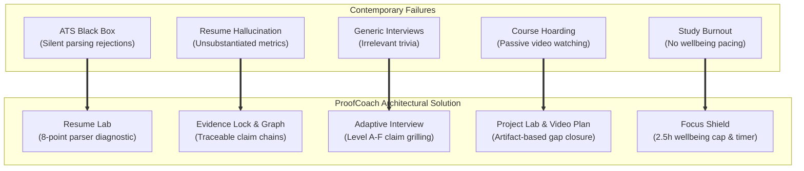
```mermaid
flowchart TD
    subgraph Contemporary Failures
        F1["ATS Black Box
(Silent parsing rejections)"]
        F2["Resume Hallucination
(Unsubstantiated metrics)"]
        F3["Generic Interviews
(Irrelevant trivia)"]
        F4["Course Hoarding
(Passive video watching)"]
        F5["Study Burnout
(No wellbeing pacing)"]
    end

    subgraph ProofCoach Architectural Solution
        S1["Resume Lab
(8-point parser diagnostic)"]
        S2["Evidence Lock & Graph
(Traceable claim chains)"]
        S3["Adaptive Interview
(Level A-F claim grilling)"]
        S4["Project Lab & Video Plan
(Artifact-based gap closure)"]
        S5["Focus Shield
(2.5h wellbeing cap & timer)"]
    end

    F1 ==> S1
    F2 ==> S2
    F3 ==> S3
    F4 ==> S4
    F5 ==> S5
```

### The Five Core Structural Breakdowns:
1. **The ATS Black Box:** Traditional candidates submit multi-column or heavily formatted resumes that Applicant Tracking Systems scramble or drop entirely. Candidates receive no actionable feedback on why their document failed extraction.
   * *ProofCoach Fix:* An 8-point local diagnostic parser that exposes exactly how machines parse the text, highlighting column ambiguities, missing headers, and unparsed tables.
2. **Resume Inflation:** Candidates copy AI-generated bullet points featuring grandiose claims (e.g., "Scaled database to 1M QPS"). When asked for p99 latency figures in interviews, they freeze.
   * *ProofCoach Fix:* Claim extraction algorithms identify every quantified statement and force the candidate to verify it in the Evidence Graph before locking it into the resume.
3. **Disconnected Mock Interviews:** Interview platforms ask generic behavioral or leetcode questions completely decoupled from what is written on the candidate's CV.
   * *ProofCoach Fix:* The Adaptive Interview engine extracts the candidate's specific claims (e.g., "Reduced latency by 35%") and initiates an evidence challenge specifically probing that sentence.
4. **Passive Learning:** Students spend hundreds of hours watching tutorials without writing code, retaining very little practical knowledge.
   * *ProofCoach Fix:* The Video Study Planner and Project Lab enforce an active 75% learning / 25% practice split, requiring learners to build concrete code artifacts for every studied module.
5. **Burnout and Overwork:** High-stress job preparation often results in endless, unstructured cramming sessions with diminishing cognitive returns.
   * *ProofCoach Fix:* The Focus Shield establishes strict 150-minute study limits, provides session autosaving, and suppresses in-app noise to encourage healthy learning habits.

---

## 5. Complete Product Map

ProofCoach AI comprises **13 distinct client routes** organized into four functional quadrants:

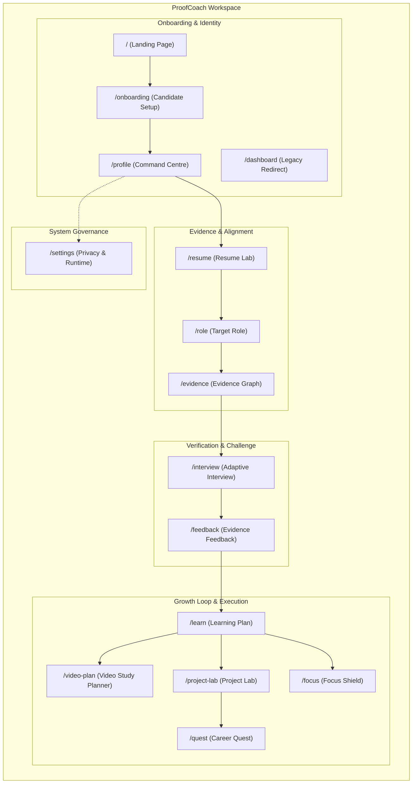
```mermaid
flowchart TD
    subgraph ProofCoach Workspace
        direction TB
        subgraph Onboarding & Identity
            R1["/ (Landing Page)"]
            R2["/onboarding (Candidate Setup)"]
            R3["/profile (Command Centre)"]
            R4["/dashboard (Legacy Redirect)"]
        end

        subgraph Evidence & Alignment
            R5["/resume (Resume Lab)"]
            R6["/role (Target Role)"]
            R7["/evidence (Evidence Graph)"]
        end

        subgraph Verification & Challenge
            R8["/interview (Adaptive Interview)"]
            R9["/feedback (Evidence Feedback)"]
        end

        subgraph Growth Loop & Execution
            R10["/learn (Learning Plan)"]
            R11["/video-plan (Video Study Planner)"]
            R12["/project-lab (Project Lab)"]
            R13["/quest (Career Quest)"]
            R14["/focus (Focus Shield)"]
        end

        subgraph System Governance
            R15["/settings (Privacy & Runtime)"]
        end
    end

    R1 --> R2 --> R3
    R3 --> R5 --> R6 --> R7 --> R8 --> R9 --> R10
    R10 --> R11
    R10 --> R12
    R12 --> R13
    R10 --> R14
    R3 -.-> R15
```

### Route Index and Component Responsibilities

| Route | View Component | Core Purpose & User Capabilities | Data Dependencies |
| :--- | :--- | :--- | :--- |
| `/` | `LandingPage.tsx` | High-impact product overview, feature cards, deterministic demo entry point. | Static demo fixtures |
| `/onboarding` | `OnboardingPage.tsx` | 3-step setup: Candidate details, target role selection, practice/interviewer preferences. | `ProofContext` |
| `/profile` | `ProfilePage.tsx` | Comprehensive candidate dossier embedding the central command center metrics. | `DemoState.candidate`, `metrics` |
| `/dashboard` | `DashboardPage.tsx` | Redirects to `/profile`; provides the 6-score diagnostic grid, priority alerts, and next 48h tasks. | `DemoState.metrics`, `completed` |
| `/resume` | `ResumePage.tsx` | Drag-and-drop PDF/DOCX parser, 8-part robustness breakdown, measurable claim detector. | Local FastAPI `/api/resume/parse` |
| `/role` | `RolePage.tsx` | Role selector & custom job description parser; skill coverage matrix & gap extraction. | Local FastAPI `/api/role/analyze` |
| `/evidence` | `EvidencePage.tsx` | Interactive React Flow DAG mapping candidate skills to projects, claims, and role specs. | `DemoState.candidate`, local API |
| `/interview` | `InterviewPage.tsx` | Real-time adaptive interview arena; Web Speech audio synthesis & transcription; level A-F probes. | Local FastAPI `/api/interview/*` |
| `/feedback` | `FeedbackPage.tsx` | Recharts radar breakdown, claim truth loop (before vs after), Evidence Lock rewrite sandbox. | `DemoState.evaluation`, local API |
| `/learn` | `LearnPage.tsx` | Prioritized gap-closure curriculum; verified free documentation links; daily study schedules. | Local FastAPI `/api/learning/plan` |
| `/video-plan` | `VideoPlanPage.tsx` | YouTube embed study orchestrator; timestamped note capture; 5-tier comprehension funnel. | `DemoState.video`, `video.ts` |
| `/project-lab` | `ProjectLabPage.tsx` | 9-stage engineering journey; Kanban task organizer; resume evidence generation. | `DemoState.project` |
| `/quest` | `QuestPage.tsx` | Gamified progression system; 3 tiers (Build, Prove, Perform); transparent XP reward rules. | `DemoState.metrics.questPoints` |
| `/focus` | `FocusPage.tsx` | Distraction-reduced workspace; 150m wellbeing countdown; 20s demo timer; autosave trigger. | `localStorage` (`proofcoach-focus-v1`) |
| `/settings` | `SettingsPage.tsx` | Dark/light theme switch, runtime mode inspector, JSON progress export, local data purge. | `ProofContext`, `/api/data` |

---

## 6. System Architecture

ProofCoach AI employs a modern, decoupled client-server architecture engineered specifically for local execution, low resource overhead, and strict privacy boundaries.

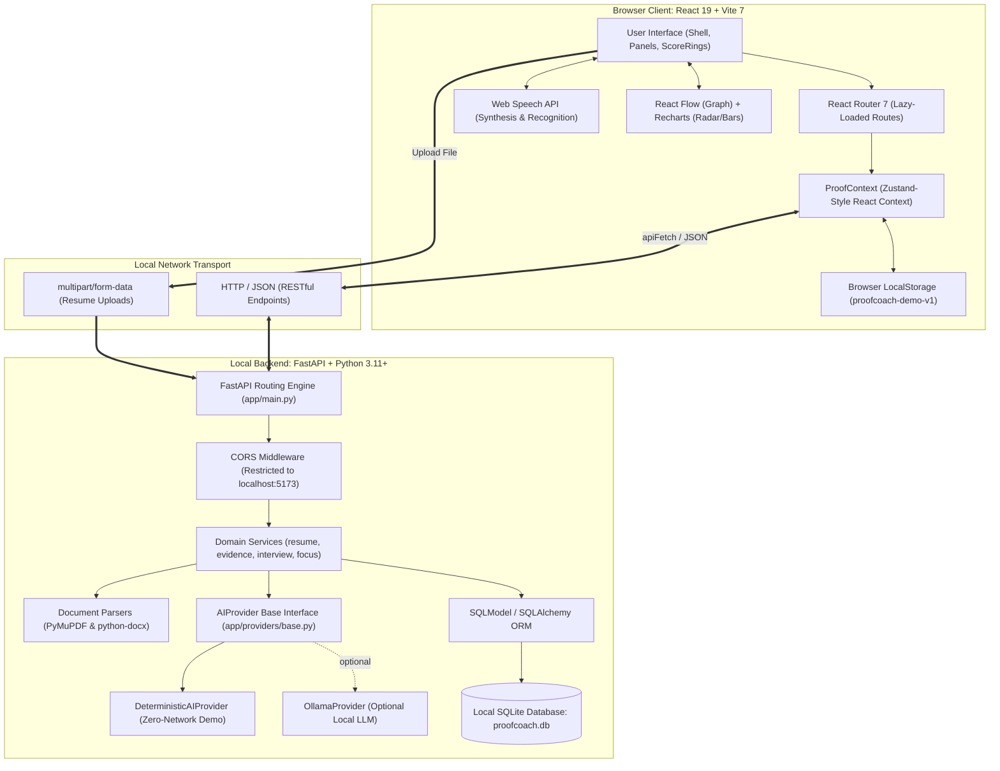
```mermaid
flowchart TB
    subgraph Client Architecture [Browser Client: React 19 + Vite 7]
        direction TB
        UI["User Interface (Shell, Panels, ScoreRings)"]
        Router["React Router 7 (Lazy-Loaded Routes)"]
        State["ProofContext (Zustand-Style React Context)"]
        StorageEngine["Browser LocalStorage (proofcoach-demo-v1)"]
        AudioEngine["Web Speech API (Synthesis & Recognition)"]
        Visuals["React Flow (Graph) + Recharts (Radar/Bars)"]

        UI --> Router
        Router --> State
        State <--> StorageEngine
        UI <--> AudioEngine
        UI <--> Visuals
    end

    subgraph TransportLayer [Local Network Transport]
        HTTP["HTTP / JSON (RESTful Endpoints)"]
        FormData["multipart/form-data (Resume Uploads)"]
    end

    subgraph Server Architecture [Local Backend: FastAPI + Python 3.11+]
        direction TB
        API["FastAPI Routing Engine (app/main.py)"]
        CORS["CORS Middleware (Restricted to localhost:5173)"]
        Services["Domain Services (resume, evidence, interview, focus)"]
        DocParsers["Document Parsers (PyMuPDF & python-docx)"]
        AIInterface["AIProvider Base Interface (app/providers/base.py)"]
        DeterministicEngine["DeterministicAIProvider (Zero-Network Demo)"]
        OllamaEngine["OllamaProvider (Optional Local LLM)"]
        DBEngine["SQLModel / SQLAlchemy ORM"]
        SQLite[(Local SQLite Database: proofcoach.db)]

        API --> CORS --> Services
        Services --> DocParsers
        Services --> AIInterface
        AIInterface --> DeterministicEngine
        AIInterface -. optional .-> OllamaEngine
        Services --> DBEngine --> SQLite
    end

    State <==>|apiFetch / JSON| HTTP <==> API
    UI ==>|Upload File| FormData ==> API
```

### 6.1 Architectural Subsystems
1. **Presentation Layer (React 19 SPA):** Utilizes Vite for bundling. Reusable atomic UI primitives (`Panel`, `ScoreRing`, `StatusPill`, `PageIntro`) ensure visual consistency across both Dark Navy and White Editorial themes.
2. **State & Reactive Store (`ProofContext.tsx`):** Maintains application-wide reactivity. Persists non-sensitive candidate configuration, active project state, video notes, and diagnostic scores to `localStorage` under key `proofcoach-demo-v1`.
3. **Transport Layer (`api.ts`):** Centralizes all HTTP communication with the backend (`http://localhost:8000`). Automatically handles network timeouts, JSON parsing, error marshalling, and transparent fallback to local demo data if the server is unreachable.
4. **Backend Application (`app/main.py`):** Built with FastAPI and Starlette. Implements asynchronous lifespan management to automatically initialize the SQLite database schema on startup without external migration scripts.
5. **Document Extraction Subsystem (`services/resume.py`):** Uses PyMuPDF (`fitz`) for PDF page extraction, character counting, and bounding-box spatial analysis to identify multi-column formatting. Uses `python-docx` to traverse paragraph and table XML trees.
6. **Heuristic & Rule Engines:** Pure Python service functions execute claim detection, skill extraction, coverage scoring, answer evaluation, and Evidence Lock filtering using deterministic pattern matching.
7. **Persistence Subsystem (`app/db.py` & `app/models.py`):** Built with SQLModel. Manages local tables for `CandidateProfile`, `ResumeRecord`, and `InterviewSession` within an embedded SQLite database.

---

## 7. Complete User Journey: A Day in the Life

To understand how ProofCoach operates in practice, consider the end-to-end journey of **Alex**, a second-year AI & Machine Learning student preparing for a Backend Developer role.

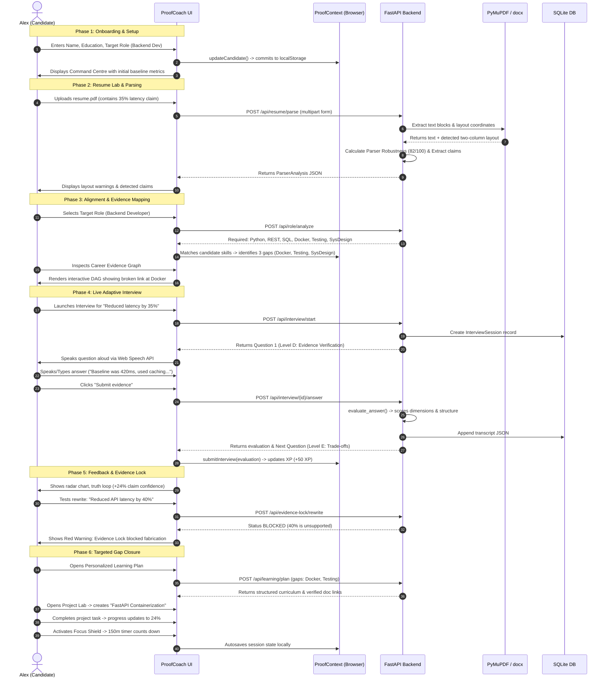
```mermaid
sequenceDiagram
    autonumber
    actor User as Alex (Candidate)
    participant UI as ProofCoach UI
    participant Ctx as ProofContext (Browser)
    participant API as FastAPI Backend
    participant Doc as PyMuPDF / docx
    participant DB as SQLite DB

    Note over User, UI: Phase 1: Onboarding & Setup
    User->>UI: Enters Name, Education, Target Role (Backend Dev)
    UI->>Ctx: updateCandidate() -> commits to localStorage
    UI->>User: Displays Command Centre with initial baseline metrics

    Note over User, UI: Phase 2: Resume Lab & Parsing
    User->>UI: Uploads resume.pdf (contains 35% latency claim)
    UI->>API: POST /api/resume/parse (multipart form)
    API->>Doc: Extract text blocks & layout coordinates
    Doc-->>API: Returns text + detected two-column layout
    API->>API: Calculate Parser Robustness (82/100) & Extract claims
    API-->>UI: Returns ParserAnalysis JSON
    UI->>User: Displays layout warnings & detected claims

    Note over User, UI: Phase 3: Alignment & Evidence Mapping
    User->>UI: Selects Target Role (Backend Developer)
    UI->>API: POST /api/role/analyze
    API-->>UI: Required: Python, REST, SQL, Docker, Testing, SysDesign
    UI->>Ctx: Matches candidate skills -> identifies 3 gaps (Docker, Testing, SysDesign)
    User->>UI: Inspects Career Evidence Graph
    UI->>User: Renders interactive DAG showing broken link at Docker

    Note over User, UI: Phase 4: Live Adaptive Interview
    User->>UI: Launches Interview for "Reduced latency by 35%"
    UI->>API: POST /api/interview/start
    API->>DB: Create InterviewSession record
    API-->>UI: Returns Question 1 (Level D: Evidence Verification)
    UI->>User: Speaks question aloud via Web Speech API
    User->>UI: Speaks/Types answer ("Baseline was 420ms, used caching...")
    User->>UI: Clicks "Submit evidence"
    UI->>API: POST /api/interview/{id}/answer
    API->>API: evaluate_answer() -> scores dimensions & structure
    API->>DB: Append transcript JSON
    API-->>UI: Returns evaluation & Next Question (Level E: Trade-offs)
    UI->>Ctx: submitInterview(evaluation) -> updates XP (+50 XP)

    Note over User, UI: Phase 5: Feedback & Evidence Lock
    UI->>User: Shows radar chart, truth loop (+24% claim confidence)
    User->>UI: Tests rewrite: "Reduced API latency by 40%"
    UI->>API: POST /api/evidence-lock/rewrite
    API-->>UI: Status BLOCKED (40% is unsupported)
    UI->>User: Shows Red Warning: Evidence Lock blocked fabrication

    Note over User, UI: Phase 6: Targeted Gap Closure
    User->>UI: Opens Personalized Learning Plan
    UI->>API: POST /api/learning/plan (gaps: Docker, Testing)
    API-->>UI: Returns structured curriculum & verified doc links
    User->>UI: Opens Project Lab -> creates "FastAPI Containerization"
    User->>UI: Completes project task -> progress updates to 24%
    User->>UI: Activates Focus Shield -> 150m timer counts down
    UI->>Ctx: Autosaves session state locally
```

---

## 8. Profile & Command Centre

### 8.1 Overview & Purpose
The Profile & Command Centre (`/profile`) serves as the central administrative cockpit of ProofCoach AI. It brings together the candidate's personal identity, academic background, target role parameters, daily practice constraints, and interviewer configuration alongside real-time diagnostic performance metrics.

<figure>
  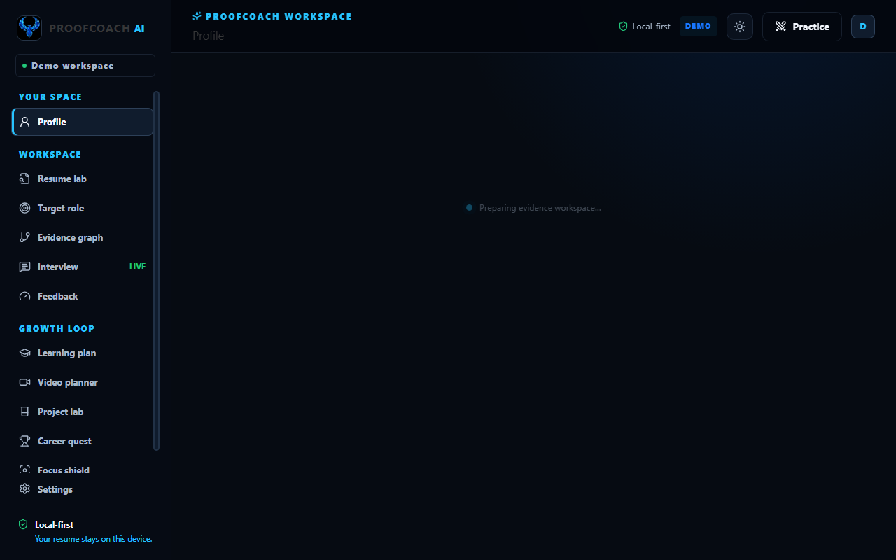
  <figcaption>Figure 8.1: Profile & Command Centre dashboard showing candidate dossier, six independent evidence metrics, and next 48-hour action items.</figcaption>
</figure>

### 8.2 Three-Layer Analysis

#### Level 1 — Simple Explanation (User View)
The candidate sees their name, educational status, target career, and daily study goal. Directly below, six diagnostic scores summarize how well their resume parses, how many skills are backed by evidence, how ready they are for interviews, how well their claims hold up, how much learning they have completed, and their current Career Quest rank. A "Next 48 Hours" action panel highlights the single most important task to work on today.

#### Level 2 — Internal Explanation (System Logic)
When `/profile` mounts, the component extracts the `candidate` object and `metrics` record from `ProofContext`. The daily time budget (stored as total minutes, e.g., 150) is formatted into human-readable hours and minutes (`2h 30m per day`). If the candidate has configured voluntary gender and selected the "Auto Pair" persona, the system renders a voluntary badge; otherwise, demographic fields remain entirely hidden. The embedded `DashboardPage` calculates the overall readiness distribution across six distinct metrics without ever combining them into a single black-box score.

#### Level 3 — Developer View (Technical Specification)
- **Source Files:** `frontend/src/pages/ProfilePage.tsx`, `frontend/src/pages/DashboardPage.tsx`
- **Component Hierarchy:** `Shell` → `ProfilePage` → `Panel`, `Detail`, `DashboardPage` → `ScoreRing`, `StatusPill`
- **State Consumed:** `state.candidate: Candidate`, `state.metrics: Record<MetricKey, number>`, `state.completed: string[]`
- **API Dependencies:** None for initial display; data is served directly from the reactive `ProofContext` store initialized from `localStorage`.
- **Persistence:** State updates trigger `localStorage.setItem('proofcoach-demo-v1', JSON.stringify(next))`.
- **Failure Modes:** If `localStorage` is empty or corrupted, `loadState()` gracefully catches the JSON parse error and populates the view with `initialDemoState`.

---

## 9. Resume Lab & Parser Robustness Engine

### 9.1 Overview & Purpose
The Resume Lab (`/resume`) provides an unvarnished, transparent diagnostic of how automated applicant-tracking systems and machine parsers interpret an uploaded resume. It explicitly rejects commercial "ATS Score" claims, instead computing a multi-attribute **Parser Robustness Score (0–100)** with spatial layout warnings.

<figure>
  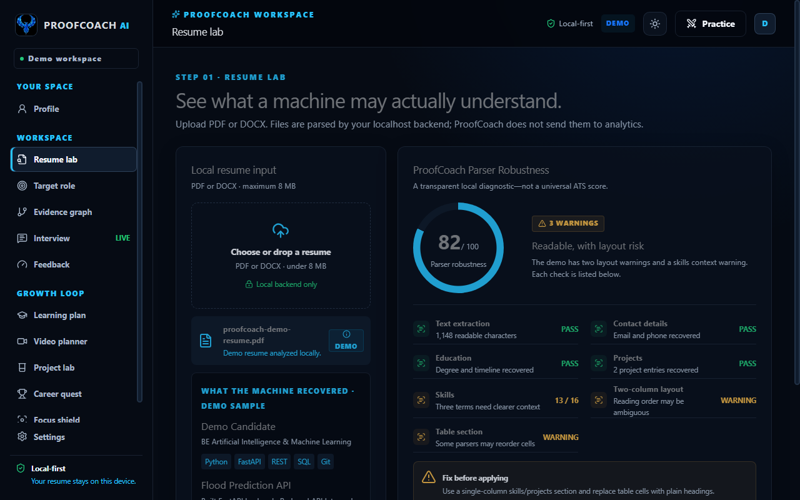
  <figcaption>Figure 9.1: Resume Lab interface displaying local file upload dropzone, recovered text preview, 8-part parser checks, and layout warnings.</figcaption>
</figure>

### 9.2 The Eight-Point Robustness Rubric
The local parser evaluates documents across 8 distinct criteria totaling 100 points:

| Check Item | Maximum Points | Passing Condition | Warning Condition & Diagnostic |
| :--- | :---: | :--- | :--- |
| **1. Text Extraction** | 20 | Text ratio $\ge 0.75$ ($\ge 675$ chars) | Less than 675 chars recovered; points scaled proportionally. |
| **2. Contact Details** | 10 | Valid email AND phone regex match | Missing email or phone format; awards 5/10. |
| **3. Recognizable Sections** | 15 | $\ge 3$ standard section headers found | Fewer than 3 headers; awards 3 pts per detected header. |
| **4. Timeline Dates** | 10 | Year (19xx/20xx) or Month names found | No recognized timeline markers; awards 4/10. |
| **5. Skill Vocabulary** | 15 | $\ge 4$ recognized catalog skills found | Fewer than 4 skills; awards 3 pts per detected skill. |
| **6. Projects Section** | 10 | Project section header recovered | Project header missing; awards 0/10. |
| **7. Two-Column Layout** | 10 | Single column reading order | Two-column layout detected via horizontal block coordinates; penalizes 6 pts (awards 4/10). |
| **8. Table Content** | 10 | No tables detected (linear text) | Word tables detected; penalizes 6 pts (awards 4/10). |

### 9.3 Three-Layer Analysis

#### Level 1 — Simple Explanation (User View)
The user drags and drops a PDF or DOCX file (under 8 MB). The screen immediately shows what text the machine was able to extract, highlights any detected skills, and lists every measurable claim found in the document. A large score ring displays the Parser Robustness score with clear warnings (e.g., "Two-column layout warning: reading order may be ambiguous").

#### Level 2 — Internal Explanation (System Logic)
1. In local mode, the file is transmitted as a `multipart/form-data` payload to `POST /api/resume/parse`.
2. PyMuPDF (`fitz`) opens the PDF stream in RAM. It computes the midpoint of each page (`rect.width / 2`). If bounding boxes are found on both the left and right of the midpoint simultaneously, `layout["two_column"]` is set to `True`.
3. For DOCX files, `python-docx` traverses paragraphs and table cell text, setting `layout["tables"] = True` if any table objects exist.
4. Regex filters scan for measurable claims using a pattern matching percentages, numerical multipliers, and active impact verbs.
5. The 8 checks are computed, summed, and returned alongside an 800-character plain-text preview.

#### Level 3 — Developer View (Technical Specification)
- **Source Files:** `frontend/src/pages/ResumePage.tsx`, `backend/app/services/resume.py`, `backend/app/main.py`
- **Functions:** `parseResume(file: File)`, `extract_text()`, `analyze_resume_text()`, `extract_claims()`
- **Regex Patterns:**
  - *Claims:* `(\d+(?:\.\d+)?\s*%|\d+[kKmM]?\+?\s+(?:users?|requests?|clients?)|(?:reduced|increased|improved|accelerated|saved|grew|led|managed|scaled|optimized))`
  - *Email:* `[\w.+-]+@[\w.-]+\.[A-Za-z]{2,}`
  - *Phone:* `(?:\+?\d[\s-]?){8,14}`
- **Fallback Behavior:** If the FastAPI backend is offline, `ResumePage` catches the network error, sets `status` to a transparent warning, and renders the deterministic demo analysis (82/100 robustness, 2 layout warnings).

---

## 10. Target Role Analysis

### 10.1 Overview & Purpose
The Target Role module (`/role`) translates ambiguous job postings into clear evidence requirements. Rather than performing simple keyword density counts, it categorizes skills into required competencies, preferred tools, and core engineering responsibilities.

<figure>
  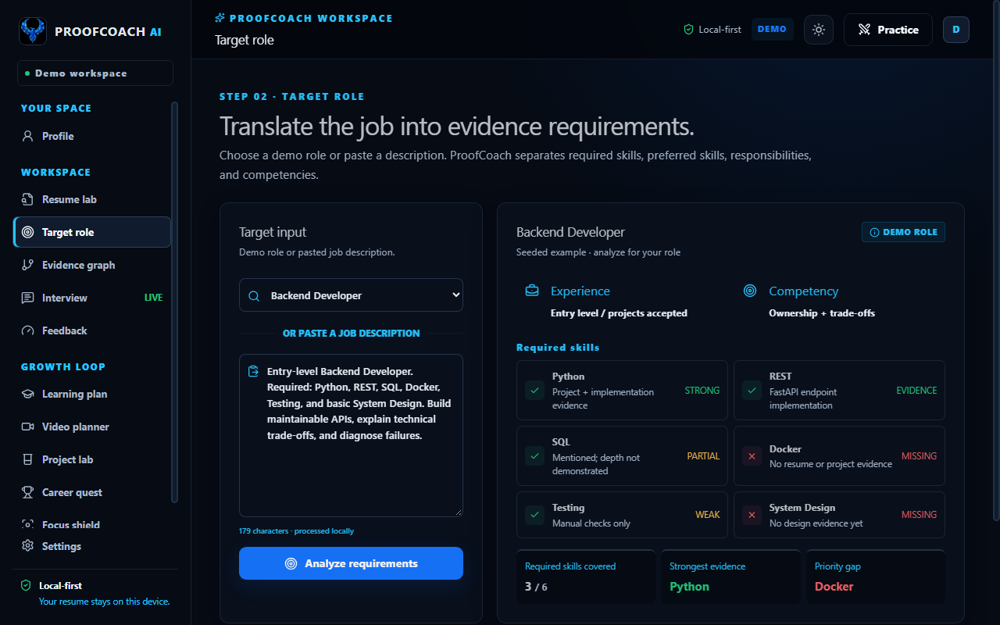
  <figcaption>Figure 10.1: Target Role analysis comparing candidate qualifications against Backend Developer requirements, highlighting gaps in Docker, Testing, and System Design.</figcaption>
</figure>

### 10.2 Three-Layer Analysis

#### Level 1 — Simple Explanation (User View)
The candidate selects a predefined demo role (e.g., Backend Developer, Frontend Developer, ML Engineer) or pastes a raw job description. The system instantly highlights which required skills the candidate already has evidence for (e.g., Python, REST, SQL) and marks missing skills as red gap indicators (e.g., Docker, Testing, System Design).

#### Level 2 — Internal Explanation (System Logic)
When the user submits a job description, `POST /api/role/analyze` searches the text against `DEMO_REQUIREMENTS`. If custom text is provided, regex word boundaries identify mentioned skills. The candidate's skills are compared case-insensitively against the requirements. The system computes coverage percentage, identifies the strongest evidence area, and extracts the top 3 critical gaps to feed into the learning pipeline.

#### Level 3 — Developer View (Technical Specification)
- **Source Files:** `frontend/src/pages/RolePage.tsx`, `backend/app/services/evidence.py`
- **Functions:** `role_analyze()`, `analyze_job()`, `skill_coverage()`
- **Data Models:**
  ```typescript
  interface RoleAnalysis {
    role: string;
    required_skills: string[];
    preferred_skills: string[];
    responsibilities: string[];
    competencies: string[];
    experience_requirement: string;
  }
  ```
- **Coverage Status Logic:**
  - `strong`: Skill is present and part of primary evidence (e.g., Python, REST).
  - `evidence` / `partial`: Skill is detected in candidate profile with limited project depth.
  - `missing`: Skill is required by role but absent from candidate profile.

---

## 11. Career Evidence Graph System

### 11.1 Overview & Purpose
The Career Evidence Graph (`/evidence`) visualizes the candidate's professional claims as an interactive Directed Acyclic Graph (DAG). It implements the core principle that a resume bullet point is not verified evidence until it connects a candidate to a skill, a project, a measurable claim, an interview defense, and an explicit job requirement.

<figure>
  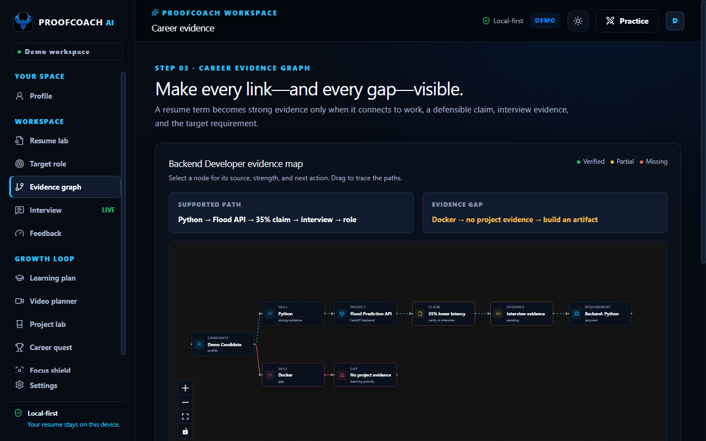
  <figcaption>Figure 11.1: Interactive Career Evidence Graph rendered via React Flow, tracing the verified Python path alongside the broken Docker evidence chain.</figcaption>
</figure>

### 11.2 Three-Layer Analysis

#### Level 1 — Simple Explanation (User View)
The user explores an interactive visual map with movable nodes. A green path traces supported evidence: Candidate → Python → Flood Prediction API → 35% Latency Claim → Interview Defense → Target Role. A red broken path highlights an evidence gap: Candidate → Docker → No Project Evidence → Gap. Clicking any node opens an Inspector sidebar detailing the node's source, evidence strength, and the exact next action needed.

#### Level 2 — Internal Explanation (System Logic)
The graph is generated using `@xyflow/react` (React Flow). Node types are mapped to a custom `EvidenceNode` component. Node positions ($x, y$) are calculated to enforce a left-to-right progression across six horizontal stages. Edges connecting verified nodes are styled with crystal-blue animated strokes (`#27c4ff` or `#1769ff`), while edges connecting missing or unverified nodes are styled with red warning borders and static dashed markers.

#### Level 3 — Developer View (Technical Specification)
- **Source Files:** `frontend/src/pages/EvidencePage.tsx`, `backend/app/services/evidence.py`
- **Graph Primitives:**
  - Nodes: `c` (Candidate), `p` (Python), `d` (Docker), `project` (Flood API), `gap` (No project), `claim` (35% claim), `interview` (Interview session), `role` (Backend requirement).
  - Inspector State: `selected: Node | null` triggers slide-in panel displaying `detail.kind`, `detail.status`, `detail.note`, and contextual next actions.
  - Color Modes: Bound to `useTheme()` to ensure background grid dots and edge colors automatically adapt between dark navy and light editorial themes.

---

## 12. Live Adaptive Interview Engine

### 12.1 Overview & Purpose
The Live Adaptive Interview (`/interview`) provides a stateful, interactive environment where candidates are interrogated on their specific resume claims. It completely rejects canned, non-contextual interview scripts, instead deploying an adaptive probing progression from Level A through Level F.

<figure>
  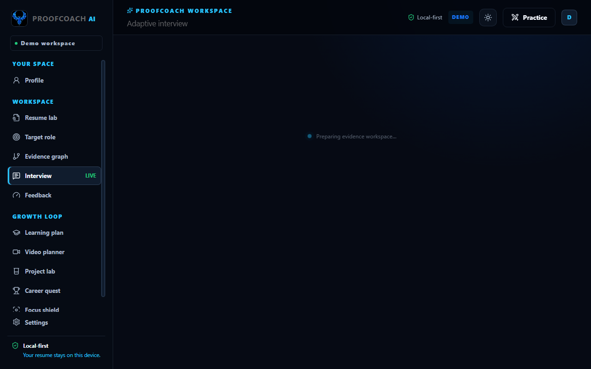
  <figcaption>Figure 12.1: Live Adaptive Interview workspace with real-time timer, Level D question probe, voice transcription controls, and observable communication metrics.</figcaption>
</figure>

### 12.2 The Six-Level Adaptive Probing Taxonomy

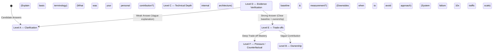
```mermaid
stateDiagram-v2
    [*] --> LevelA: Candidate Answers
    LevelA: Level A — Clarification
(Explain basic terminology)
    LevelB: Level B — Ownership
(What was your personal contribution?)
    LevelC: Level C — Technical Depth
(Explain internal architecture)
    LevelD: Level D — Evidence Verification
(What was baseline & measurement?)
    LevelE: Level E — Trade-offs
(Downsides & when to avoid approach)
    LevelF: Level F — Pressure / Counterfactual
(System failure & 10x traffic scale)

    LevelD --> LevelE: Strong Answer (Clear baseline + ownership)
    LevelD --> LevelA: Weak Answer (Vague explanation)
    LevelE --> LevelF: Deep Trade-off Mastery
    LevelE --> LevelB: Vague Contribution
```

### 12.3 Three-Layer Analysis

#### Level 1 — Simple Explanation (User View)
The user faces an AI interviewer avatar. The current question challenges their 35% latency claim: *"What was the original baseline, how did you measure the improvement, and what did you personally change?"* The user can click a speaker icon to hear the question spoken aloud, and can respond either by typing into a structured text box or speaking via browser speech recognition. A word counter and session timer track progress.

#### Level 2 — Internal Explanation (System Logic)
1. On component mount, the frontend calls `POST /api/interview/start` to register an active session in SQLite and fetch Question 0 (Level D).
2. The user speaks or types. If voice is activated, the Web Speech API (`webkitSpeechRecognition`) streams interim transcripts into local state.
3. Upon clicking "Submit evidence", the text is transmitted to `POST /api/interview/{session_id}/answer`.
4. The backend evaluation service parses the answer for baseline markers (`\d+\s*(?:ms|seconds?|%)`), measurement terms (`benchmark`, `postman`, `p95`), personal pronouns (`I changed`, `I implemented`), trade-off terms (`cache invalidation`, `memory cost`), and filler words (`um`, `uh`, `like`).
5. A detailed evaluation payload is returned, updating the session transcript and determining the next question level.

#### Level 3 — Developer View (Technical Specification)
- **Source Files:** `frontend/src/pages/InterviewPage.tsx`, `backend/app/services/interview.py`, `backend/app/main.py`
- **State Properties:** `state.answer: string`, `state.interviewSessionId: number | null`, `currentQ: { level, label, reason, text }`
- **Browser APIs Used:** `window.speechSynthesis` (for text-to-speech), `window.SpeechRecognition` / `window.webkitSpeechRecognition` (for voice input).
- **Communication Indicators Observed:**
  - `word_count`: Total tokens extracted via `[\w'-]+`.
  - `filler_words`: Count of `um`, `uh`, `like`, `basically`.
  - `answer_structure`: Classified as `clear` if $\ge 45$ words with structured markers; otherwise `developing`.
  - `relevance`: Evaluated based on domain keywords (`latency`, `api`, `cache`, `measure`).

---

## 13. Evidence Feedback Engine & Evidence Lock

### 13.1 Overview & Purpose
The Feedback Engine (`/feedback`) delivers structured, multi-dimensional feedback following an interview. It features the **Resume Truth Loop**, which quantifies how the interview changed demonstrated claim confidence, and **Evidence Lock**, an interactive sandbox that protects candidates from generating fraudulent resume bullets.

<figure>
  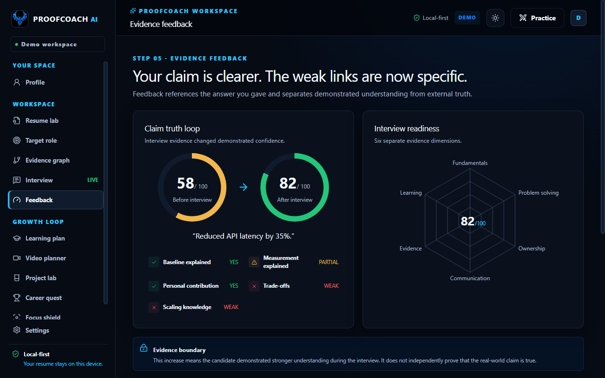
  <figcaption>Figure 13.1: Evidence Feedback dashboard featuring the Claim Truth Loop (58% to 82%), 6-dimension radar chart, and Evidence Lock rewrite test.</figcaption>
</figure>

### 13.2 Three-Layer Analysis

#### Level 1 — Simple Explanation (User View)
The screen displays a radar chart covering 6 dimensions: Fundamentals, Problem Solving, Ownership, Communication, Evidence, and Learning. The Resume Truth Loop shows that demonstrated confidence in the 35% latency claim increased from 58% to 82%. In the Evidence Lock box, the user can test two rewrites: a safe version ("Optimized API response performance") which is approved, and an unsupported version ("Reduced API latency by 40%") which is immediately blocked.

#### Level 2 — Internal Explanation (System Logic)
The 82% claim confidence score does not claim independent real-world truth; it reflects the candidate's demonstrated ability to substantiate their baseline (420 ms) and measurement method (Postman runs). Evidence Lock enforces rules via `assess_rewrite()` in `backend/app/services/evidence_lock.py`:
- Checks proposed text against confirmed numerical facts and technology keywords (`TECH_TERMS`).
- If an unsupported number (e.g., `40%`) or technology (e.g., `Kubernetes`) appears in the rewrite without existing in the original bullet or confirmed facts, `status` returns `blocked` with a red UI token.
- If only stylistic words change, `status` returns `safe`.

#### Level 3 — Developer View (Technical Specification)
- **Source Files:** `frontend/src/pages/FeedbackPage.tsx`, `backend/app/services/evidence_lock.py`
- **Visual Primitives:** Recharts `<RadarChart>` wrapped inside `<ResponsiveContainer width="100%" height={285}>`.
- **Dimensions Evaluated:**
  ```python
  dimensions = {
      "baseline": "yes" if baseline else "partial",
      "measurement": "yes" if measurement and has_digits else "partial" if measurement else "weak",
      "personal_contribution": "yes" if ownership else "partial",
      "trade_offs": "yes" if tradeoffs else "weak",
      "scaling_knowledge": "yes" if scaling else "weak",
  }
  ```
- **Confidence Formula:**
  $$	ext{Confidence}_{	ext{after}} = \min(88, 58 + 8 	imes N_{	ext{yes}} + 4 	imes N_{	ext{partial}})$$

---

## 14. Personalized Learning Plan

### 14.1 Overview & Purpose
The Learning Plan (`/learn`) closes the loop between interview failures and technical remediation. Instead of recommending 40-hour video courses, it generates concise, high-priority learning tracks targeting the candidate's exact role gaps.

<figure>
  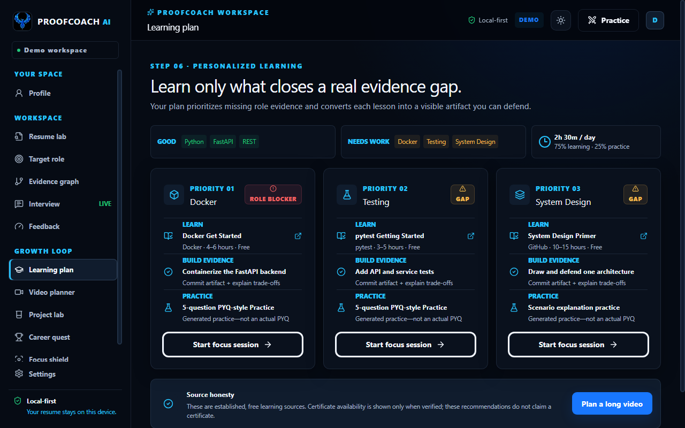
  <figcaption>Figure 14.1: Personalized Learning Plan prioritizing Docker (Role Blocker), Testing (Gap), and System Design (Gap) with direct links to official documentation.</figcaption>
</figure>

### 14.2 Three-Layer Analysis

#### Level 1 — Simple Explanation (User View)
The user sees their target daily study time (2h 30m / day) divided into a 75% learning / 25% practice split. Three prioritized cards address their gaps: Priority 1 (Docker - Role Blocker), Priority 2 (Testing - Gap), and Priority 3 (System Design - Gap). Each card provides a direct link to free, authoritative documentation (e.g., Docker Get Started, pytest docs) and assigns a mandatory artifact to build.

#### Level 2 — Internal Explanation (System Logic)
The component dispatches `POST /api/learning/plan` with the candidate's identified gaps and daily time budget. The backend maps each gap to verified primary resources in `RESOURCE_CATALOG`. Crucially, every task enforces an active triad:
1. **Learn:** Study official documentation.
2. **Build Evidence:** Create a concrete code artifact (e.g., "Containerize the FastAPI backend").
3. **Practice:** Complete a 5-question PYQ-style practice set.

#### Level 3 — Developer View (Technical Specification)
- **Source Files:** `frontend/src/pages/LearnPage.tsx`, `backend/app/services/learning.py`
- **State Binding:** Dynamic time allocation calculated as:
  ```typescript
  const hours = Math.floor(state.candidate.dailyMinutes / 60);
  const mins = state.candidate.dailyMinutes % 60;
  ```
- **Source Honesty Policy:** Every external resource explicitly displays its provider, estimated time, and cost. If a certificate is not verified, the UI states: *"These recommendations do not claim a certificate."*

---

## 15. Video Study Planner

### 15.1 Overview & Purpose
The Video Study Planner (`/video-plan`) tackles the pervasive problem of "tutorial hell" by converting passive video consumption into an active, structured study schedule. It enforces an authorized YouTube embed player, daily video chunking, and timestamped note-taking.

<figure>
  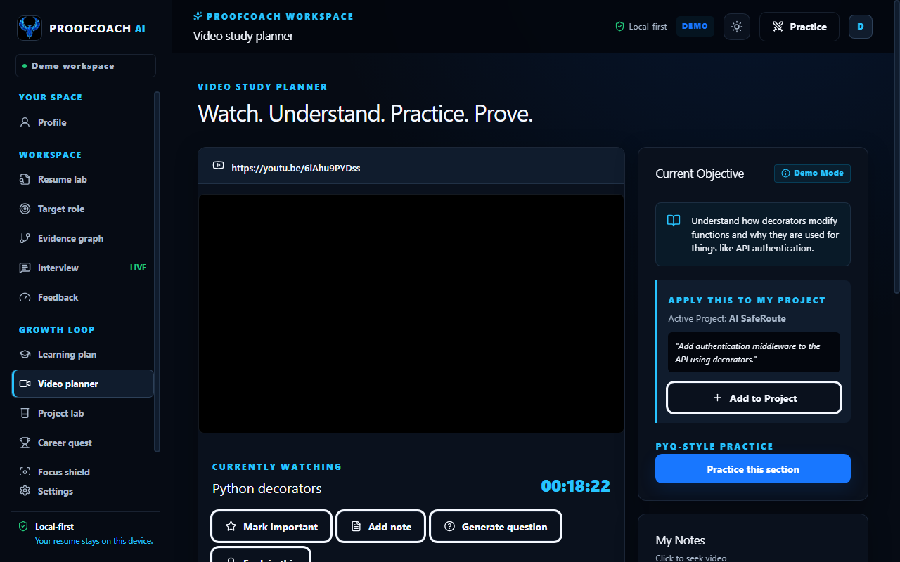
  <figcaption>Figure 15.1: Video Study Planner featuring authorized YouTube embed, current objective card, note-taking timeline, and 5-stage comprehension funnel.</figcaption>
</figure>

### 15.2 Three-Layer Analysis

#### Level 1 — Simple Explanation (User View)
The candidate pastes a YouTube tutorial link. The planner embeds the video using privacy-enhanced mode (`youtube-nocookie.com`). As they watch, they can click "Add note" or "Mark important" to save timestamped notes. A 5-stage comprehension funnel tracks progress across: Watched (45%) → Understood (30%) → Practiced (15%) → Applied (10%) → Proven (5%). A daily planner breaks a multi-hour tutorial into manageable day-by-day segments.

#### Level 2 — Internal Explanation (System Logic)
The component validates the URL using `videoId()` in `services/video.ts`, strictly requiring an 11-character alphanumeric video ID from `youtu.be` or `youtube.com`. Daily sessions are computed using the formula:
$$	ext{Learning Budget} = 	ext{round}(	ext{Daily Minutes} 	imes 0.75)$$
$$	ext{Days Required} = \lceil 	ext{Duration} / 	ext{Learning Budget} 
ceil$$
Notes taken during playback are committed to `state.video.notes` in `ProofContext` and survive page refreshes.

#### Level 3 — Developer View (Technical Specification)
- **Source Files:** `frontend/src/pages/VideoPlanPage.tsx`, `frontend/src/services/video.ts`, `backend/app/services/learning.py`
- **State Data Model:**
  ```typescript
  interface VideoNote {
    id: string;
    timestamp: number;
    topic: string;
    text: string;
  }
  interface VideoState {
    watched: number;
    understood: number;
    practiced: number;
    applied: number;
    proven: number;
    notes: VideoNote[];
  }
  ```
- **Copyright & Privacy Boundary:** The application never downloads, scrapes, or stores copyrighted video streams. It uses the official YouTube iframe embed with `referrerPolicy="strict-origin-when-cross-origin"`.

---

## 16. Project Lab: Artifact Engineering

### 16.1 Overview & Purpose
The Project Lab (`/project-lab`) is ProofCoach AI's execution engine. It ensures that students and freshers do not merely accumulate theoretical knowledge, but build, test, and document real software artifacts that can withstand technical scrutiny.

<figure>
  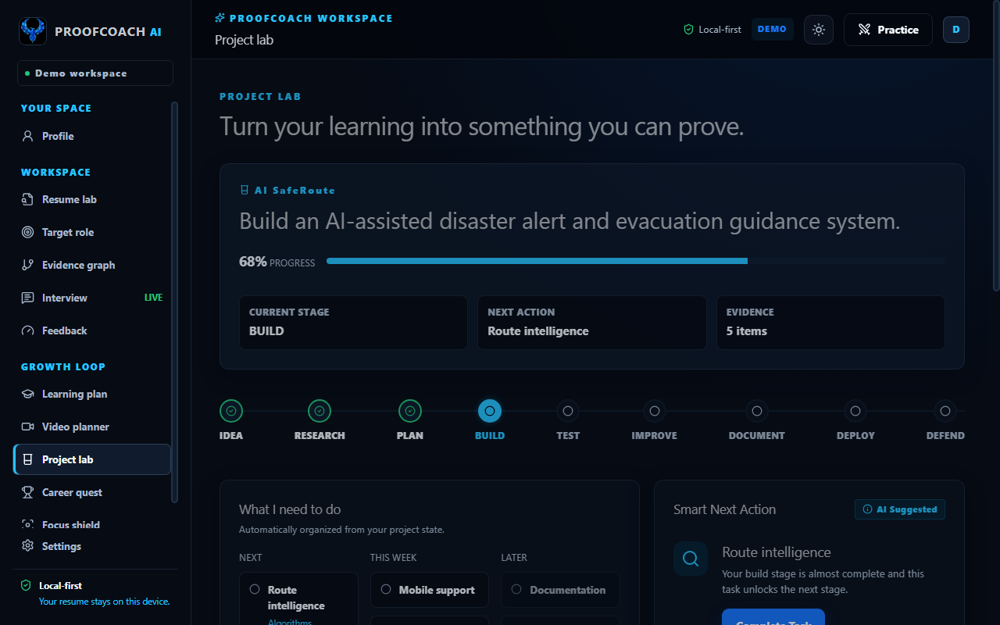
  <figcaption>Figure 16.1: Project Lab workspace displaying the 9-stage engineering journey, dynamic task board (NEXT / THIS WEEK / LATER), and interview defense preview.</figcaption>
</figure>

### 16.2 The Nine-Stage Engineering Journey
Every project progresses through an industry-standard development lifecycle:

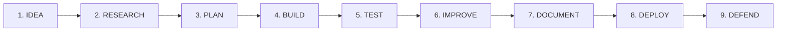
```mermaid
flowchart LR
    S1[1. IDEA] --> S2[2. RESEARCH] --> S3[3. PLAN] --> S4[4. BUILD] --> S5[5. TEST] --> S6[6. IMPROVE] --> S7[7. DOCUMENT] --> S8[8. DEPLOY] --> S9[9. DEFEND]
```

### 16.3 Three-Layer Analysis

#### Level 1 — Simple Explanation (User View)
The user manages their active project (e.g., "AI SafeRoute - Flood Prediction API"). An engineering progress bar shows completion (24%). A Kanban task board divides actions into NEXT, THIS WEEK, LATER, and COMPLETED. Clicking any task marks it complete, immediately advancing project progress. A "Defend This Project" panel previews three core questions that an interviewer will ask about the project.

#### Level 2 — Internal Explanation (System Logic)
When a candidate checks off a task, `completeTask(taskId)` is dispatched to `ProofContext`. The task's stage transitions to `COMPLETED`, its `completed` boolean flag is set to `true`, and overall project progress advances incrementally:
$$	ext{Progress}_{	ext{next}} = \min(100, 	ext{Progress}_{	ext{current}} + 4)$$
Completed tasks with attached evidence strings automatically populate the "Project Evidence" panel, providing one-click export into the Resume Lab.

#### Level 3 — Developer View (Technical Specification)
- **Source Files:** `frontend/src/pages/ProjectLabPage.tsx`, `frontend/src/types.ts`
- **State Data Model:**
  ```typescript
  interface ProjectTask {
    id: string;
    title: string;
    stage: 'NEXT' | 'THIS WEEK' | 'LATER' | 'COMPLETED';
    completed: boolean;
    priority?: string;
    evidence?: string;
    skill?: string;
  }
  interface ProjectState {
    id: string;
    name: string;
    goal: string;
    stage: string;
    progress: number;
    tasks: ProjectTask[];
  }
  ```
- **New Project Wizard:** If `state.project` is null, `ProjectLabPage` renders an embedded two-step setup wizard allowing the candidate to initialize a custom project with custom objectives.

---

## 17. Career Quest Progression Engine

### 17.1 Overview & Purpose
Career Quest (`/quest`) gamifies the career preparation journey through transparent, merit-based Evidence XP. It explicitly avoids dark-pattern gamification (e.g., daily login streaks or superficial clicks), rewarding only verified, artifact-backed achievements.

<figure>
  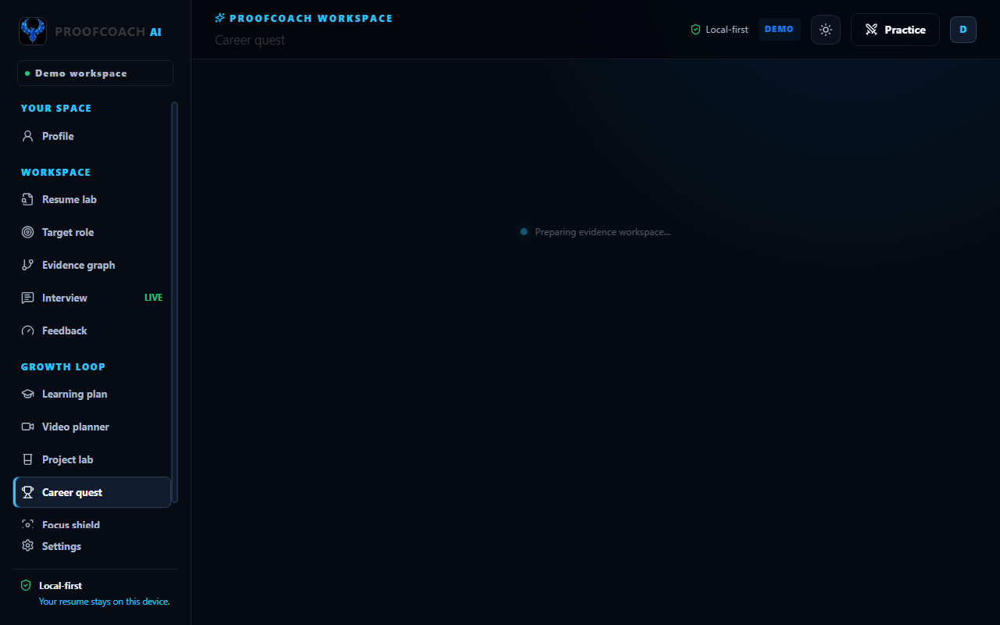
  <figcaption>Figure 17.1: Career Quest progression screen displaying current Evidence XP (185 XP), Level 2 Pathfinder rank, and transparent point rules.</figcaption>
</figure>

### 17.2 The Three Quest Tiers & XP Rules

| Quest Level | Name | Theme | Key Included Work | Level Reward |
| :---: | :--- | :--- | :--- | :---: |
| **Level 1** | **Build** | Foundation | Upload resume, fix parser warnings, select role, map evidence graph. | 100 XP |
| **Level 2** | **Prove** | Competency | Verify claims, complete learning modules, build gap artifacts, Evidence Lock rewrite. | 150 XP |
| **Level 3** | **Perform** | Mastery | Live interview defense, deep trade-off interrogation, final simulated interview. | 250 XP |

#### Transparent Action-Linked Rewards:
- Resume fix: `+20 XP`
- Evidence added: `+25 XP`
- Lesson completed: `+10 XP`
- Quiz passed: `+15 XP`
- Adaptive Interview completed: `+30 XP` (seeded demo awards `+50 XP` for comprehensive defense)
- Claim improved: `+20 XP`
- Complete tier milestone: `+100 XP`

### 17.3 Three-Layer Analysis
- **Level 1 (User View):** The user tracks their Evidence XP (185 XP) and rank ("Pathfinder - Level 2"). Level 1 is marked Complete with green checkmarks, Level 2 is Active, and Level 3 is Locked until Level 2 tasks are fulfilled.
- **Level 2 (Internal Logic):** XP is stored in `state.metrics.questPoints`. Progression percentage is derived as `questPoints / 4`. Submitting an interview automatically increments `questPoints` by 50 in `submitInterview()`.
- **Level 3 (Developer View):** Defined in `frontend/src/pages/QuestPage.tsx` and seeded via `questLevels` in `frontend/src/data/demo.ts`.

---

## 18. Focus Shield & Wellbeing System

### 18.1 Overview & Purpose
Focus Shield (`/focus`) provides an intensive, distraction-minimized study environment with an integrated wellbeing governor. It ensures that candidates maintain healthy learning habits by enforcing a 2.5-hour maximum continuous study session with automatic progress autosaving.

<figure>
  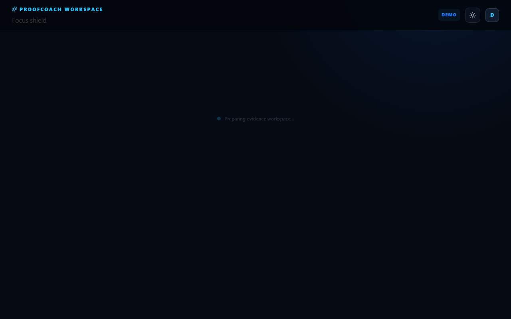
  <figcaption>Figure 18.1: Focus Shield workspace showing circular countdown clock, 20-second demo toggle, and honest Future Mobile Integration disclaimer.</figcaption>
</figure>

### 18.2 Three-Layer Analysis

#### Level 1 — Simple Explanation (User View)
The screen strips away distracting navigation elements, presenting a large circular countdown timer set to a 2h 30m wellbeing limit. Controls allow the user to Start, Pause, Finish, or Reset the session. For quick demonstrations, a "Demo timer mode" toggle compresses the 2.5-hour limit to 20 seconds. An Emergency Contact simulator is provided, accompanied by an honest notice explaining that web browsers cannot block phone calls.

#### Level 2 — Internal Explanation (System Logic)
The timer runs client-side via a 1000 ms `setInterval` loop. The CSS conical gradient (`--progress`) dynamically visualizes elapsed percentage:
$$	ext{Progress \%} = 	ext{round}\left(rac{	ext{Elapsed}}{	ext{Limit}}
ight) 	imes 100$$
When `elapsed >= limit`, the session ends automatically, `running` is set to `false`, `ended` is set to `true`, and state is autosaved to `localStorage` under `proofcoach-focus-v1`.

#### Level 3 — Developer View (Technical Specification)
- **Source Files:** `frontend/src/pages/FocusPage.tsx`, `backend/app/services/focus.py`
- **Storage Key:** `proofcoach-focus-v1` storing `{ demo: boolean, elapsed: number, ended: boolean }`.
- **Localhost Optimization:** To eliminate unnecessary network round-trips every second, the timer loop executes entirely in the browser. The backend endpoint `POST /api/focus/status` remains available for server-side state synchronization.
- **Honest System Boundary:** The UI features an explicit warning: *"A browser website cannot guarantee blocking WhatsApp, phone calls, or OS notifications. This prototype does not fake that capability."*

---

## 19. Settings, Runtime Controls & Privacy Purge

### 19.1 Overview & Purpose
The Settings module (`/settings`) implements ProofCoach AI's core privacy and data ownership guarantees. It provides instant theme switching, runtime mode inspection, complete data export, and an irreversible one-click data destruction mechanism.

<figure>
  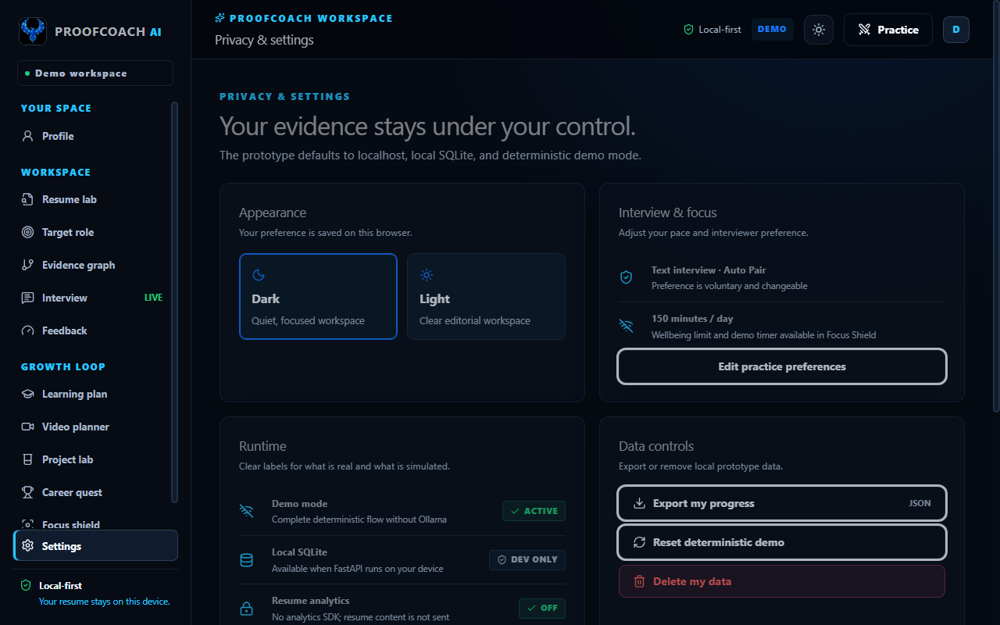
  <figcaption>Figure 19.1: Settings and Privacy panel showing appearance options, runtime diagnostic indicators, JSON export, and Delete My Data purge modal.</figcaption>
</figure>

### 19.2 Three-Layer Analysis

#### Level 1 — Simple Explanation (User View)
The user can toggle between Dark Navy and White Editorial themes. Runtime cards confirm that the system is operating in Local-First Demo Mode with zero analytics tracking. Three action buttons allow the candidate to export their entire progress as a JSON file, reset the deterministic demo to its original state, or permanently delete all local data.

#### Level 2 — Internal Explanation (System Logic)
1. **JSON Export:** Serializes the complete reactive `DemoState` object into a formatted JSON Blob and triggers an automated browser download for `proofcoach-progress.json`.
2. **Deterministic Reset:** Calls `resetDemo()` in `ProofContext`, replacing the local state with `initialDemoState`.
3. **Data Purge Cascade:** Clicking "Delete my data" opens an accessible confirmation modal. Upon confirmation, the application dispatches `DELETE /api/data` to the FastAPI backend (which truncates all rows in `CandidateProfile`, `ResumeRecord`, and `InterviewSession`), purges `localStorage` keys `proofcoach-demo-v1` and `proofcoach-focus-v1`, and navigates the user back to the landing page.

#### Level 3 — Developer View (Technical Specification)
- **Source Files:** `frontend/src/pages/SettingsPage.tsx`, `frontend/src/services/api.ts`, `backend/app/main.py`
- **Data Purge Implementation:**
  ```python
  @app.delete("/api/data")
  def delete_my_data(session: Session = Depends(get_session)) -> dict:
      for model in (InterviewSession, ResumeRecord, CandidateProfile):
          session.exec(delete(model))
      session.commit()
      return {"deleted": ["profile", "resume", "interview transcript"], "local_database_retained_empty": True}
  ```

---

## 20. Frontend Architecture & UI Design System

### 20.1 Directory Layout & Component Structure
The frontend is constructed using React 19, TypeScript 5.9, and Vite 7. The project maintains an intentional separation between reusable UI primitives, global shell layouts, route-level page views, and state providers.

```
frontend/
├── public/
│   ├── assets/
│   │   ├── phoenix-watermark.jpg     # Official Blue Crystal Phoenix asset
│   │   └── favicon.svg
├── src/
│   ├── components/                   # Shared UI primitives & Layout Shell
│   │   ├── Brand.tsx                 # Phoenix logo & typography lockup
│   │   ├── Shell.tsx                 # Global responsive sidebar, topbar & navigation
│   │   ├── ThemeToggle.tsx           # Accessible light/dark theme switch
│   │   └── UI.tsx                    # Atomic design tokens (Panel, ScoreRing, StatusPill)
│   ├── context/                      # React Context providers
│   │   ├── ProofContext.tsx          # Central application state & persistence
│   │   └── ThemeContext.tsx          # Dual-theme engine & preference sync
│   ├── data/
│   │   └── demo.ts                   # Deterministic fixtures & initial demo state
│   ├── pages/                        # Lazy-loaded route components (13 total)
│   ├── services/                     # Client-side utility functions & HTTP client
│   │   ├── api.ts                    # Fetch wrapper targeting localhost:8000
│   │   ├── theme.ts                  # Theme resolution & local storage engine
│   │   └── video.ts                  # YouTube URL parser & ID extractor
│   ├── App.tsx                       # React Router configuration & route definitions
│   ├── main.tsx                      # DOM entry point & provider bootstrapping
│   ├── styles.css                    # Semantic CSS variables & responsive rules
│   └── types.ts                      # Strict TypeScript domain interfaces
├── package.json
└── vite.config.ts
```

### 20.2 Design System & Dual-Theme Tokens
The interface utilizes a technical, crystal-inspired aesthetic. It supports two full-palette themes powered by CSS custom properties defined in `styles.css`.

| Semantic Variable | Dark Navy Theme (Default) | White Editorial Theme | Semantic Role |
| :--- | :--- | :--- | :--- |
| `--bg` | `#03060D` (Deep Void Navy) | `#F7F9FC` (Cool Editorial White) | Application canvas background |
| `--surface` | `#0A111D` (Glass Card Surface) | `#FFFFFF` (Pure Crisp White) | Card and panel containers |
| `--surface-subtle` | `#0F172A` | `#F1F5F9` | Table rows, code blocks, dividers |
| `--text` | `#F4F8FF` (High-Contrast White) | `#111827` (Deep Editorial Slate) | Primary headlines and body copy |
| `--muted` | `#7E8FA6` | `#64748B` | Subtitles, timestamps, placeholders |
| `--primary` | `#1877FF` (Vibrant Electric Blue) | `#1769FF` (Refined Ink Blue) | Primary action buttons and focus rings |
| `--crystal` | `#27C4FF` (Luminous Cyan) | `#007DBD` (Deep Precision Cyan) | Brand accents, active meters, graph nodes |
| `--success` | `#22C77A` (Verified Emerald) | `#16875F` (Forest Green) | Passing scores, verified claims |
| `--warning` | `#F2B84B` (Amber Alert) | `#A66413` (Warm Ochre) | Partial evidence, layout warnings |
| `--danger` | `#F26161` (Critical Coral) | `#D64545` (Crimson Warning) | Blocked claims, role blockers |

#### Preventing Flash of Unstyled Theme (FOUC):
In `index.html`, an inline bootstrap script executes synchronously before React mounts:
```javascript
const saved = localStorage.getItem('proofcoach-theme');
const theme = saved === 'light' || saved === 'dark' ? saved : 'dark';
document.documentElement.setAttribute('data-theme', theme);
```

---

## 21. Backend Architecture & Service Layer

### 21.1 Module Structure & Separation of Concerns
The backend is built with FastAPI and Python 3.11+. It follows a pure-function domain service pattern where business logic is decoupled from HTTP transport.

```
backend/
├── app/
│   ├── config.py             # Pydantic Settings (CORS, demo mode, ports)
│   ├── db.py                 # SQLite database engine & session dependency
│   ├── main.py               # FastAPI application, route handlers & lifespan
│   ├── models.py             # SQLModel persistence entities (table=True)
│   ├── schemas.py            # Pydantic v2 request/response schemas
│   ├── seed.py               # Deterministic resume text & state fixtures
│   ├── providers/            # AI Provider abstraction layer
│   │   ├── base.py           # Abstract base class for AI operations
│   │   └── demo.py           # Deterministic implementation (zero external calls)
│   └── services/             # Pure domain logic functions
│       ├── evidence.py       # Job matching, skill coverage & graph builder
│       ├── evidence_lock.py  # Regex & dictionary claim classification
│       ├── focus.py          # Session timer & wellbeing logic
│       ├── interview.py      # Adaptive questioning & rubric evaluation
│       ├── learning.py       # Gap-to-resource curriculum generator
│       └── resume.py         # PyMuPDF text & layout extraction
├── tests/
│   └── test_core.py          # 9 automated unit tests verifying core logic
├── requirements.txt
└── pytest.ini
```

### 21.2 The Provider Abstraction Pattern
To support both zero-network hackathon demonstrations and optional self-hosted LLMs, the platform defines a strict provider interface in `backend/app/providers/base.py`:
```python
class AIProvider(ABC):
    @abstractmethod
    def extract_resume_facts(self, text: str) -> dict: ...
    @abstractmethod
    def analyze_job_requirements(self, description: str) -> dict: ...
    @abstractmethod
    def generate_interview_question(self, context: dict) -> dict: ...
    @abstractmethod
    def evaluate_interview_answer(self, answer: str, context: dict) -> dict: ...
    @abstractmethod
    def assess_evidence_lock_rewrite(self, original: str, proposed: str) -> dict: ...
```
The active `DeterministicAIProvider` implements this interface using deterministic heuristics, ensuring the platform runs reliably offline without unexpected token costs or network latency.

---

## 22. State Management: ProofContext & Reactive Loops

### 22.1 Global State Architecture
Client-side state is centralized in `ProofContext.tsx` via the `useProof()` hook. It manages a unified `DemoState` interface that synchronizes user actions across all 13 routes.

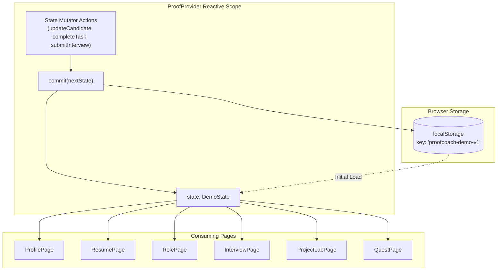
```mermaid
flowchart TD
    subgraph Browser Storage
        LS[("localStorage
key: 'proofcoach-demo-v1'")]
    end

    subgraph ProofProvider Reactive Scope
        State["state: DemoState"]
        Mutators["State Mutator Actions
(updateCandidate, completeTask, submitInterview)"]
        Commit["commit(nextState)"]
        
        Mutators --> Commit
        Commit --> State
        Commit --> LS
        LS -. Initial Load .-> State
    end

    subgraph Consuming Pages
        P1["ProfilePage"]
        P2["ResumePage"]
        P3["RolePage"]
        P4["InterviewPage"]
        P5["ProjectLabPage"]
        P6["QuestPage"]
    end

    State --> P1
    State --> P2
    State --> P3
    State --> P4
    State --> P5
    State --> P6
```

### 22.2 State Property Inventory & Mutation Rules

| Property | Data Type | Default / Seeded Value | Mutation Action | Persistence Scope |
| :--- | :--- | :--- | :--- | :--- |
| `candidate` | `Candidate` | Demo Candidate (BE AI/ML) | `updateCandidate(partial)` | `localStorage` |
| `completed` | `string[]` | `['profile', 'resume', ...]` | `complete(key)` | `localStorage` |
| `metrics` | `Record<MetricKey, number>` | `{ parser: 82, coverage: 50, ... }` | `setMetric(key, val)` | `localStorage` |
| `interviewAnswered`| `boolean` | `false` | `submitInterview()` | `localStorage` |
| `currentQuestion` | `number` | `0` (Level D) | `submitInterview()` | `localStorage` |
| `answer` | `string` | `""` | `setAnswer(str)` | `localStorage` |
| `interviewSessionId`| `number \| null` | `null` | `startInterview(id)` | `localStorage` |
| `evaluation` | `any \| null` | `null` | `submitInterview(eval)` | `localStorage` |
| `evidenceLockDemo`| `'idle'\|'safe'\|'blocked'` | `'idle'` | `setEvidenceLockDemo(val)` | `localStorage` |
| `project` | `ProjectState \| null` | AI SafeRoute (Flood API) | `updateProject()`, `completeTask()` | `localStorage` |
| `video` | `VideoState` | `{ watched: 45, notes: [...] }` | `addVideoNote(note)` | `localStorage` |

---

## 23. Data Flow Traces across System Boundaries

### Flow A: The Resume → Evidence → Interview → Feedback Loop
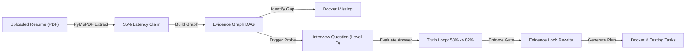
```mermaid
flowchart LR
    A["Uploaded Resume (PDF)"] -->|PyMuPDF Extract| B["35% Latency Claim"]
    B -->|Build Graph| C["Evidence Graph DAG"]
    C -->|Identify Gap| D["Docker Missing"]
    C -->|Trigger Probe| E["Interview Question (Level D)"]
    E -->|Evaluate Answer| F["Truth Loop: 58% -> 82%"]
    F -->|Enforce Gate| G["Evidence Lock Rewrite"]
    G -->|Generate Plan| H["Docker & Testing Tasks"]
```

### Flow B: Live Interview Execution & Evaluation Flow
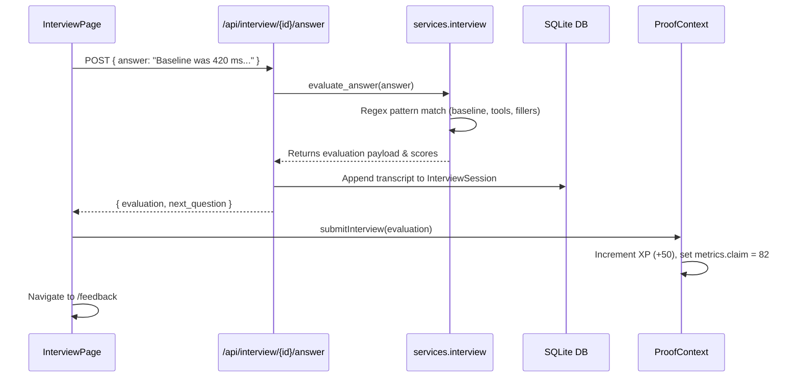
```mermaid
sequenceDiagram
    participant UI as InterviewPage
    participant API as /api/interview/{id}/answer
    participant Svc as services.interview
    participant DB as SQLite DB
    participant Ctx as ProofContext

    UI->>API: POST { answer: "Baseline was 420 ms..." }
    API->>Svc: evaluate_answer(answer)
    Svc->>Svc: Regex pattern match (baseline, tools, fillers)
    Svc-->>API: Returns evaluation payload & scores
    API->>DB: Append transcript to InterviewSession
    API-->>UI: { evaluation, next_question }
    UI->>Ctx: submitInterview(evaluation)
    Ctx->>Ctx: Increment XP (+50), set metrics.claim = 82
    UI->>UI: Navigate to /feedback
```

---

## 24. Persistence, Storage & Data Lifecycle

ProofCoach AI enforces strict data governance across all storage mediums:

| Storage Medium | Key / Table Name | Data Stored | Lifetime | Reset / Purge Behavior |
| :--- | :--- | :--- | :--- | :--- |
| **Browser LocalStorage** | `proofcoach-demo-v1` | Serialized `DemoState` JSON (candidate, metrics, project, video notes) | Persistent across sessions | Wiped on "Delete My Data" or reset to demo fixtures |
| **Browser LocalStorage** | `proofcoach-focus-v1` | Active timer state `{ demo, elapsed, ended }` | Persistent across refreshes | Wiped on "Delete My Data" |
| **Browser LocalStorage** | `proofcoach-theme` | Appearance string (`'dark'` or `'light'`) | Persistent across sessions | Preserved across demo resets |
| **Local SQLite DB** | `candidateprofile` | Candidate name, category, education, preferences | Persistent on host machine | Truncated via `DELETE /api/data` |
| **Local SQLite DB** | `resumerecord` | Extracted text preview, parser score, analysis JSON | Persistent on host machine | Truncated via `DELETE /api/data` |
| **Local SQLite DB** | `interviewsession` | Session level, question index, full transcript JSON | Persistent on host machine | Truncated via `DELETE /api/data` |
| **RAM (In-Memory)** | Fast API UploadFile | Raw PDF/DOCX binary stream (max 8 MB) | Lifetime of HTTP request only | Destroyed immediately after text extraction |

---

## 25. APIs & Local Services Specification

The FastAPI backend exposes **13 high-performance REST endpoints** on `http://localhost:8000`:


```mermaid
flowchart LR
    subgraph REST API Surface
        H["/api/health [GET]"]
        DR["/api/demo/reset [POST]"]
        DS["/api/demo/state [GET]"]
        RP["/api/resume/parse [POST]"]
        RA["/api/role/analyze [POST]"]
        EG["/api/evidence/graph [POST]"]
        CE["/api/claims/extract [POST]"]
        IS["/api/interview/start [POST]"]
        IA["/api/interview/{id}/answer [POST]"]
        EL["/api/evidence-lock/rewrite [POST]"]
        LP["/api/learning/plan [POST]"]
        VP["/api/video/plan [POST]"]
        DD["/api/data [DELETE]"]
    end
```

### Complete OpenAPI-Style Endpoint Index

| Method | Endpoint Path | Request Body | Response Schema | Description |
| :--- | :--- | :--- | :--- | :--- |
| `GET` | `/api/health` | None | `{ status, mode, local_first }` | Healthcheck and runtime provider verification. |
| `POST` | `/api/demo/reset` | None | `{ reset, state }` | Truncates SQLite tables and re-seeds deterministic demo data. |
| `GET` | `/api/demo/state` | None | `DemoState` JSON | Returns full deterministic view model for zero-setup demos. |
| `POST` | `/api/resume/parse` | `multipart/form-data` (`file`) | `ParserAnalysis` | Extracts text and evaluates the 8-point robustness rubric. |
| `POST` | `/api/role/analyze` | `{ role, job_description }` | `RoleAnalysis` | Analyzes role requirements, responsibilities, and competencies. |
| `POST` | `/api/evidence/graph`| `{ candidate_skills, required_skills }` | `{ nodes, edges, coverage }` | Constructs DAG node and edge topology for React Flow. |
| `POST` | `/api/claims/extract` | `{ text }` | `{ claims: [...] }` | Extracts quantified achievement statements from raw text. |
| `POST` | `/api/interview/start`| `{ claim, mode }` | `{ session_id, level, question }` | Initializes interview session record in SQLite. |
| `POST` | `/api/interview/{id}/answer`| `{ answer }` | `{ evaluation, next_question }` | Scores candidate answer and determines next adaptive probe. |
| `POST` | `/api/evidence-lock/rewrite`| `{ original, proposed, confirmed }`| `{ status, color, message, ... }` | Classifies rewrite into Safe, Confirm, or Blocked. |
| `POST` | `/api/learning/plan` | `{ gaps, daily_minutes }` | `{ daily_minutes, split, tasks }` | Generates prioritized learning curriculum and artifact goals. |
| `POST` | `/api/video/plan` | `{ title, duration, daily_minutes, notes }` | `{ days, sessions, concepts }` | Chunks long video tutorials into daily study/practice sessions. |
| `DELETE`| `/api/data` | None | `{ deleted, local_database_retained_empty }` | Permanent purge of all candidate database records. |

---

## 26. Algorithms & Internal Logic Implementation

### 26.1 Parser Robustness Scoring Formula
The robustness score $S_{	ext{robust}}$ is calculated as:
$$S_{	ext{robust}} = \max\left(0, \min\left(100, \sum_{i=1}^{8} P_i
ight)
ight)$$
Where $P_i$ represents points awarded for each of the 8 checks:
1. $P_1 = 	ext{round}(20 	imes \min(1.0, L_{	ext{text}} / 675))$
2. $P_2 = 10 	ext{ if (email and phone) else } 5$
3. $P_3 = \min(15, N_{	ext{sections}} 	imes 3)$
4. $P_4 = 10 	ext{ if dates found else } 4$
5. $P_5 = \min(15, N_{	ext{skills}} 	imes 3)$
6. $P_6 = 10 	ext{ if projects found else } 0$
7. $P_7 = 4 	ext{ if two-column else } 10$
8. $P_8 = 4 	ext{ if tables found else } 10$

### 26.2 Evidence Lock Verification Logic
```python
def assess_rewrite(original: str, proposed: str, confirmed_facts: list[str] = None):
    confirmed_facts = confirmed_facts or []
    # 1. Extract numerical tokens
    original_numbers = set(NUMBER_PATTERN.findall(original)) | {
        item for fact in confirmed_facts for item in NUMBER_PATTERN.findall(fact)
    }
    proposed_numbers = set(NUMBER_PATTERN.findall(proposed))
    invented_numbers = sorted(proposed_numbers - original_numbers)

    # 2. Extract technical terms
    original_tech = {t for t in TECH_TERMS if t.lower() in original.lower()}
    proposed_tech = {t for t in TECH_TERMS if t.lower() in proposed.lower()}
    invented_tech = sorted(proposed_tech - original_tech)

    # 3. Block unsupported facts
    if invented_numbers or invented_tech:
        return {
            "status": "blocked",
            "unsupported": invented_numbers + invented_tech,
            "message": "Evidence Lock prevented an unsupported achievement from being added."
        }
    
    # 4. Check for unconfirmed power verbs
    if any(v in proposed.lower() for v in ["led", "architected", "owned"]) and        not any(v in original.lower() for v in ["led", "architected", "owned"]):
        return {"status": "confirm", "message": "Ownership elevated; confirm evidence."}

    return {"status": "safe", "message": "Wording improved without adding new facts."}
```

### 26.3 Video Planner Chunking Formula
```python
learning_budget = round(daily_minutes * 0.75)
practice_budget = daily_minutes - learning_budget
days_required = math.ceil(duration_minutes / learning_budget)
```

---

## 27. Security, Privacy & Local-First Verification

### 27.1 Telemetry and Network Isolation
- **Zero Third-Party Telemetry:** No Google Analytics, Mixpanel, Sentry, or Segment SDKs are installed or imported.
- **Localhost Binding:** FastAPI binds by default to `127.0.0.1:8000`. CORS middleware explicitly restricts origins to `http://localhost:5173` and `http://127.0.0.1:5173`.
- **Ephemeral Upload Processing:** Uploaded resume files are passed as raw bytes in memory directly to PyMuPDF. No resume PDF or DOCX file is ever written to disk or stored in permanent directories.
- **Git Hygiene:** Local databases (`*.db`, `*.sqlite3`), virtual environments (`.venv/`), and environment files (`.env`) are strictly excluded via `.gitignore`.

---

## 28. Technology Stack Analysis

ProofCoach AI is built with an intentionally lightweight, modern, and production-tested technology stack.

### 28.1 Frontend Technologies

| Library / Tool | Version | Role in ProofCoach AI | Architectural Rationale |
| :--- | :---: | :--- | :--- |
| **React** | `19.0.0` | Declarative UI framework | Concurrent rendering, native transition hooks, component reusability. |
| **Vite** | `7.3.6` | Frontend bundler & dev server | Sub-millisecond HMR, optimized tree-shaking production builds. |
| **TypeScript** | `5.9.3` | Static type safety | Strict type enforcement across domain models (`Candidate`, `ProjectState`). |
| **Tailwind CSS** | `3.4.17` | Utility CSS foundation | Rapid layout scaffolding complementing custom semantic CSS tokens. |
| **React Router** | `7.1.5` | Client-side routing engine | Multi-page client routing, history management, and code-split lazy loading. |
| **@xyflow/react** | `12.4.4` | Career Evidence Graph | Interactive node-based DAG rendering with custom HTML handles and zoom/pan. |
| **Recharts** | `2.15.1` | Diagnostic data visualization | SVG-based Radar charts, bar meters, and responsive metric graphs. |
| **Framer Motion** | `12.4.7` | UI transitions & animations | Micro-interactions, page entrance fade-ins, and step transitions. |
| **Lucide React** | `0.475.0` | System iconography | Clean, accessible technical icon set across all 13 routes. |

### 28.2 Backend Technologies

| Library / Tool | Version | Role in ProofCoach AI | Architectural Rationale |
| :--- | :---: | :--- | :--- |
| **Python** | `3.11+` | Backend runtime environment | Fast execution, robust typing, rich text-processing ecosystem. |
| **FastAPI** | `0.116.1` | Local REST API framework | High-throughput asynchronous routing, automatic OpenAPI generation. |
| **SQLModel** | `0.0.24` | ORM & data persistence | Combines SQLAlchemy with Pydantic v2 for type-safe SQLite persistence. |
| **PyMuPDF (fitz)**| `1.26.4` | High-speed PDF text parser | Spatial coordinate analysis, block layout extraction, zero external binaries. |
| **python-docx** | `1.2.0` | Word document text parser | Direct XML parsing of DOCX paragraphs and table structures. |
| **Pydantic** | `2.13.5` | Data validation & schemas | Strict runtime input/output validation, fast C-extension serialization. |
| **Uvicorn** | `0.35.0` | ASGI application server | Lightweight, reliable local HTTP server with automatic hot-reloading. |
| **Pytest** | `8.4.2` | Automated testing framework | Fast, deterministic testing of services, parsers, and Evidence Lock. |

---

## 29. Third-Party Services & Dependency Verification

An exhaustive audit of the codebase confirms that ProofCoach AI maintains **zero runtime dependencies on cloud services or external AI vendors**:

| Service / Dependency | Integration Status | Data Sent | Data Received | Criticality |
| :--- | :--- | :--- | :--- | :--- |
| **OpenAI / Claude / Gemini APIs** | **Not Present** | None | None | None. Platform uses deterministic heuristics. |
| **Ollama (Local LLM)** | **Optional** | Prompt text (localhost only) | Generated text | Optional. Codebase runs 100% without Ollama. |
| **YouTube IFrame Embed** | **External Client** | Video ID parameter | Video player iframe | Required only for `/video-plan` visual embed. |
| **Google Analytics / Telemetry**| **Not Present** | None | None | None. Prohibited by privacy policy. |
| **Cloud Hosting (Vercel)** | **Client Hosting** | Static JS/CSS assets | Static assets | Frontend demo hosting only. Backend remains local. |

---

## 30. Feature Connection Matrix

The following matrix documents how data originates, transfers, and influences connected modules across the platform:

| Feature Module | Reads Data From | Writes / Mutates Data To | Downstream Influence |
| :--- | :--- | :--- | :--- |
| **Onboarding** | User form inputs | `state.candidate` | Profile, Command Centre, Target Role, Interview Persona |
| **Resume Lab** | Raw PDF/DOCX file | `state.metrics.parser`, claims | Career Evidence Graph, Claim Detector, Interview Questioning |
| **Target Role** | Job text / demo roles | Role requirements, skill gaps | Career Evidence Graph, Learning Plan priorities, Interview Context |
| **Evidence Graph** | Candidate skills + Role gaps | React Flow node layout | Visual gap inspection, next action recommendations |
| **Adaptive Interview**| Resume claim + Role context | `state.answer`, `session_id` | Truth Loop confidence, Radar scores, XP rewards |
| **Feedback Engine** | Interview answer evaluation | `state.evaluation`, `metrics` | Evidence Lock rewrites, Personalized Learning recommendations |
| **Evidence Lock** | Proposed bullet points | `state.evidenceLockDemo` | Prevents resume hallucination; feeds safe rewrites to Resume Lab |
| **Learning Plan** | Target role gaps | Active study curriculum | Directs candidate into Project Lab and Focus Shield |
| **Video Planner** | YouTube URL + notes | `state.video.notes`, progress | Daily study scheduling, concept mastery tracking |
| **Project Lab** | Learning goals | `state.project.tasks`, progress | Generates tangible resume evidence; triggers interview defense |
| **Career Quest** | Platform-wide actions | `state.metrics.questPoints` | Unlocks progression levels (Build → Prove → Perform) |
| **Focus Shield** | Time limit preference | `proofcoach-focus-v1` (storage) | Autosaves active study sessions; locks intensive activity at limit |
| **Settings** | User preferences | Theme tokens, full data purge | Global styling, complete reset of SQLite and browser storage |

---

## 31. File & Code Responsibility Directory

### 31.1 Frontend Key Modules (`frontend/src/`)
- `App.tsx`: Central router declaring 13 application routes with code-split lazy loading and `Suspense` fallbacks.
- `types.ts`: Master TypeScript interface definitions (`Candidate`, `ProjectTask`, `ProjectState`, `VideoNote`, `DemoState`).
- `context/ProofContext.tsx`: The application's reactive engine; manages state mutation actions and synchronizes to `localStorage`.
- `context/ThemeContext.tsx`: Manages dark/light theme state, listening to OS color preferences and storing overrides.
- `components/Shell.tsx`: The master layout wrapper rendering the responsive sidebar, brand header, and view transitions.
- `components/UI.tsx`: Shared atomic design components (`Panel`, `ScoreRing`, `StatusPill`, `PageIntro`, `EvidenceNotice`).
- `services/api.ts`: Fetch client configured to communicate with `http://localhost:8000` with graceful offline fallback.
- `services/video.ts`: Regex-based YouTube URL validator and 11-character video ID extractor.
- `data/demo.ts`: Immutable fallback fixtures providing deterministic seed data for zero-network demonstrations.

### 31.2 Backend Key Modules (`backend/app/`)
- `main.py`: FastAPI initialization, CORS security middleware, and 13 REST API route handlers.
- `models.py`: SQLModel database entities (`CandidateProfile`, `ResumeRecord`, `InterviewSession`).
- `schemas.py`: Pydantic v2 schemas validating request and response payloads.
- `db.py`: SQLite engine initialization and dependency-injected session management.
- `services/resume.py`: PyMuPDF text extraction, spatial bounding-box column analysis, and the 8-point robustness rubric.
- `services/evidence.py`: Case-insensitive job-skill matching, coverage calculations, and Evidence Graph DAG generator.
- `services/evidence_lock.py`: Regex pattern matching and technical vocabulary verification preventing fabricated claims.
- `services/interview.py`: Level A through F question selector and multi-dimensional answer rubric evaluation engine.
- `services/learning.py`: Gap-to-curriculum generator and mathematical video study chunking algorithm.
- `services/focus.py`: Session timer governor and wellbeing state evaluator.

---

## 32. How the System Thinks: The Cognitive Flow

ProofCoach AI's internal intelligence can be conceptualized as an 8-stage cognitive processing loop:

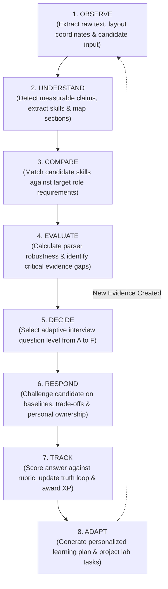
```mermaid
flowchart TD
    O["1. OBSERVE
(Extract raw text, layout coordinates & candidate input)"]
    --> U["2. UNDERSTAND
(Detect measurable claims, extract skills & map sections)"]
    --> C["3. COMPARE
(Match candidate skills against target role requirements)"]
    --> E["4. EVALUATE
(Calculate parser robustness & identify critical evidence gaps)"]
    --> D["5. DECIDE
(Select adaptive interview question level from A to F)"]
    --> R["6. RESPOND
(Challenge candidate on baselines, trade-offs & personal ownership)"]
    --> T["7. TRACK
(Score answer against rubric, update truth loop & award XP)"]
    --> A["8. ADAPT
(Generate personalized learning plan & project lab tasks)"]
    
    A -. New Evidence Created .-> O
```

1. **Observe:** The system ingests raw PDF/DOCX bytes or job description text.
2. **Understand:** Regex patterns and NLP tokenizers identify sections, dates, technologies, and quantified metrics.
3. **Compare:** The candidate's verified skill set is compared against the target role's expectations.
4. **Evaluate:** Strengths are confirmed; gaps are tagged as role blockers.
5. **Decide:** The engine selects an interview probe tailored specifically to the highest-risk claim.
6. **Respond:** The interviewer delivers the challenge via text and Web Speech audio.
7. **Track:** Answer quality updates the Resume Truth Loop and increments Career Quest XP.
8. **Adapt:** Gaps exposed during questioning are automatically translated into project tasks in the Project Lab.

---

## 33. Demo vs Reality: Transparent Capability Audit

To maintain complete transparency, the following audit distinguishes fully operational local features from simulated or demo behaviors:

| Feature / Subsystem | Operational Reality | Implementation Mechanism | Notes & Limitations |
| :--- | :--- | :--- | :--- |
| **PDF/DOCX Text Extraction** | **100% Real** | PyMuPDF (`fitz`) and `python-docx` | Runs locally in memory; handles standard documents. |
| **Two-Column Layout Detection** | **100% Real** | Horizontal bounding-box coordinate analysis | Heuristic-based; complex multi-frame magazines may vary. |
| **Parser Robustness Score** | **100% Real** | 8-point transparent algorithmic rubric | Real diagnostic calculation; not an ATS score. |
| **Evidence Lock Filtering** | **100% Real** | Regex extraction & set-difference logic | Reliably catches new numbers and unconfirmed tech terms. |
| **Interactive Evidence Graph** | **100% Real** | `@xyflow/react` (React Flow) | Fully interactive DAG with zoom, pan, and inspector. |
| **Local SQLite Persistence** | **100% Real** | SQLModel / SQLite (`proofcoach.db`) | Real database operations on local host. |
| **Local Data Purge** | **100% Real** | `DELETE /api/data` + storage wipe | Completely wipes database tables and local storage. |
| **Adaptive Interview Flow** | **Deterministic Logic** | Stateful Python service + local fallback | Implements Levels A–F probing using deterministic templates. |
| **Answer Evaluation** | **Deterministic Heuristics**| Keyword, baseline, and structure regex | Accurate for structured answers; not a full LLM evaluator. |
| **Browser Speech Recognition** | **100% Real** | Web Speech API (`webkitSpeechRecognition`) | Hardware and browser-dependent; text fallback provided. |
| **Emergency Contact Action** | **Simulated** | Client-side notification dispatch | Explicitly labeled as a simulation; no SMS/calls sent. |
| **Wellbeing Cap / Demo Timer**| **100% Real** | Client-side timer loop & autosave | Compresses 2.5h to 20s for evaluation. |
| **OS Notification Blocking** | **Future Work** | Not implemented (honest disclaimer) | Disclaimed as requiring native mobile OS integration. |

---

## 34. Current Technical Limitations

An honest audit of the current prototype reveals the following engineering boundaries:
1. **Frontend-Only Cloud Deployment:** The public Vercel deployment hosts the client-side SPA. Without a running local FastAPI backend, the Vercel demo operates purely on deterministic client fixtures.
2. **Single-User SQLite Concurrency:** SQLite is ideally suited for local-first single-user installations, but cannot support high-concurrency multi-tenant cloud deployments without PostgreSQL.
3. **Lexical vs. Semantic Parsing:** Skill and claim extraction rely on sophisticated regex dictionaries rather than semantic vector embeddings. Unconventional phrasing may not be recognized.
4. **Browser Speech Variability:** The Web Speech API depends heavily on Google Chrome's underlying engine. In Firefox or Safari, speech recognition gracefully degrades to text input.
5. **Static Course Catalog:** Learning resources (`RESOURCE_CATALOG`) are statically defined. External link rot or course restructuring requires periodic manual catalog curation.

---

## 35. Production Roadmap & Future Extensions

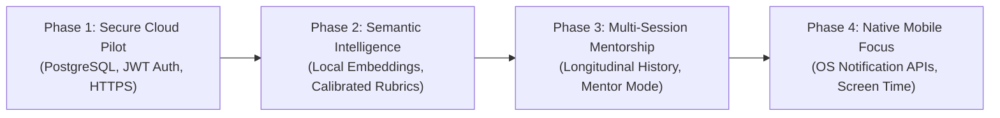
```mermaid
flowchart LR
    P1["Phase 1: Secure Cloud Pilot
(PostgreSQL, JWT Auth, HTTPS)"]
    --> P2["Phase 2: Semantic Intelligence
(Local Embeddings, Calibrated Rubrics)"]
    --> P3["Phase 3: Multi-Session Mentorship
(Longitudinal History, Mentor Mode)"]
    --> P4["Phase 4: Native Mobile Focus
(OS Notification APIs, Screen Time)"]
```

### Phase 1 — Secure Multi-User Pilot
- Transition from SQLite to PostgreSQL with Alembic database migrations.
- Implement stateless JWT authentication with encrypted user data at rest.
- Introduce presigned S3 upload URLs with automatic resume-file destruction after parsing.

### Phase 2 — Semantic Intelligence & Local LLMs
- Integrate lightweight local embedding models (e.g., `bge-small-en`) via ONNX Runtime for semantic skill matching.
- Connect local Ollama instances (`llama3:8b` or `mistral`) for dynamically generated interview follow-ups while strictly maintaining Evidence Lock boundaries.

### Phase 3 — Longitudinal Growth & Mentor Portals
- Track candidate improvement over weeks, rendering time-series readiness trajectories.
- Add an exportable "Evidence Portfolio" that candidates can share with real hiring managers.

### Phase 4 — Native Mobile Focus Companion
- Develop React Native mobile apps for iOS and Android.
- Integrate Apple Screen Time APIs and Android Digital Wellbeing APIs to enforce true OS-level notification blocking during focus study sessions.

---

## Technical Glossary

- **ATS (Applicant Tracking System):** Enterprise HR software that ingests, parses, and filters resume files before human recruiters review them.
- **Career Evidence Graph:** A directed acyclic graph (DAG) mapping skills to projects, measurable claims, interview defenses, and job requirements.
- **Deterministic Vertical Slice:** A fully functional software slice that executes predictable, reproducible logic without external network dependencies.
- **Evidence Lock:** A rule-based security mechanism that prevents generative AI from fabricating numbers, metrics, or technologies on a resume.
- **Local-First Architecture:** A software design pattern where data storage, compute, and execution occur primarily on the user's local device.
- **Parser Robustness Score:** A transparent 0–100 diagnostic calculated by ProofCoach that measures how reliably a machine can extract document text without formatting errors.
- **PYQ-Style Practice:** Practice questions modeled after Previous Year Questions, generated algorithmically without claiming historical provenance.
- **Resume Truth Loop:** A verification feedback cycle in which interview answers directly alter the system's demonstrated confidence in a resume claim.
- **Web Speech API:** A browser API providing speech recognition (voice input) and speech synthesis (text-to-speech) capabilities.

---

## Appendix: Verification & Test Coverage

### Automated Backend Test Suite (`backend/tests/test_core.py`)
All 9 core unit tests pass with 100% reliability under Python 3.11+:
1. `test_backend_health`: Verifies `/api/health` returns status `ok` and `local_first: true`.
2. `test_resume_parser_components_are_transparent`: Confirms Parser Robustness score falls between 0–100, detects Python, warns on two-column layouts, and includes disclaimer.
3. `test_claim_extraction_finds_quantified_claim`: Verifies regex extracts *"Reduced API latency by 35%"*.
4. `test_job_skill_matching_is_case_insensitive`: Confirms case-insensitive matching across `["python", "REST", "Sql"]`.
5. `test_evidence_lock_blocks_invented_metric`: Verifies that adding an unconfirmed `40%` metric is blocked.
6. `test_evidence_lock_allows_grammar_only_rewrite`: Verifies that stylistic improvements are classified as `safe`.
7. `test_interview_evidence_does_not_claim_external_truth`: Confirms claim confidence increases without claiming real-world truth.
8. `test_demo_timer_ends_at_twenty_seconds`: Verifies demo timer ends exactly at 20 seconds with autosave enabled.
9. `test_demo_seed_is_complete_and_non_personal`: Verifies initial synthetic fixtures are non-personal and complete.

### Frontend Quality Assurance Commands
- `npm run lint`: Zero ESLint warnings or errors under strict TypeScript rules.
- `npm run typecheck`: Strict `tsc -b` type checking passes with zero type mismatches.
- `npm run build`: Production Vite bundling compiles successfully in under 10 seconds.
